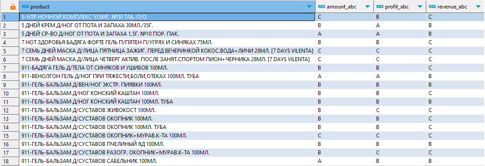
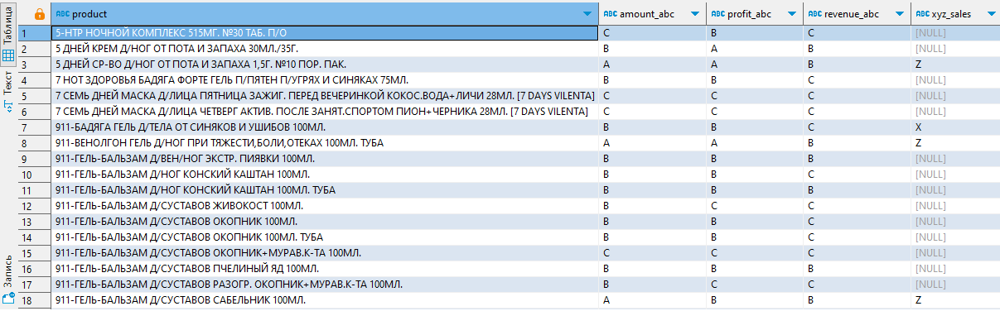
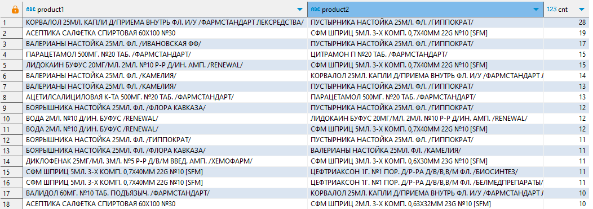
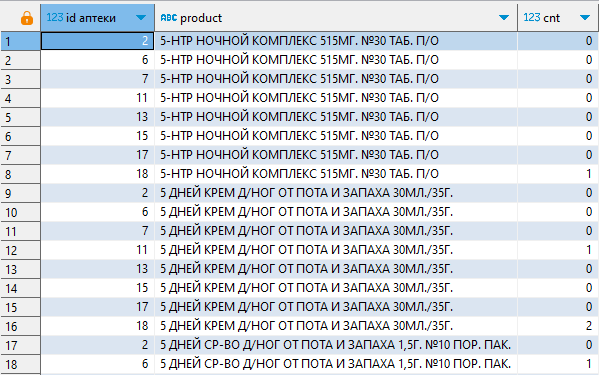

# Анализ аптечной сети

Проект был выполнен в интерактивном тренажере Simulative

Состоит из нескольких заданий на составление запросов к БД (PostgreSQL) 

Подключение к базе данных (например в DBeaver):  
Хост: 95.163.241.236  
Порт: 5432  
База данных: apteka  
Юзер: student  
Пароль: qweasd963  

Описание данных, которые хранят таблицы:
https://docs.google.com/document/d/1qKDKq_d8Mhud5p3mADxWWxlIrPx-EfHzvuE0j02dKtA/edit?usp=sharing

Был проведено несколько анализов: многомерный ABC анализ, XYZ анализ в дополнение к ABC, анализ сочетаемости товаров, а также составлена таблица продаж по аптекам

ABC анализ: по выручке, по количеству проданных позиций и по прибыли с позиции.
Пример:
|product|amount_abc|profit_abc|revenue_abc|
|--|--|--|--|
|product1|A|C|A|
|product1|C|B|B|

Результат:

Дополнительно для этого же запроса был проведен XYZ. Он проводился по количеству проданного товара с группировкой по неделям, т.к. данных не слишком много
Так же сделано доп. условие, чтобы товар продавался как минимум в 4-х разных неделях. 
|product|amount_abc|profit_abc|revenue_abc|xyz_sales|
|--|--|--|--|--|
|product1|A|C|A|X|
|product1|C|B|B|Z|

Результат:

Далее был проведен анализ сочетаемости товаров, а именно - узнать количество раз, когда какие-либо два товара встретились вместе в одном чеке
При этом даже в рамках одного чека один и тот же товар может фигурировать в нескольких строках. 
Нужно сделать предварительную обработку так, чтобы избежать дублирования данных в результате анализа.
|product1|product2|cnt|
|--|--|--|
|Терафлю|Лизобакт|1|

Результат:

После построил полную таблицу продаж товаров во всех аптеках в формате «аптека - товар - продано штук». 
Если вдруг в какой-то аптеке конкретный товар не продавался, то просто выводим 0.
|product|id аптеки|cnt|
|--|--|--|
|Отривин|1|0|
|Термометр|1|10|
|Отривин|2|2|
|Термометр|2|1|

Результат:
