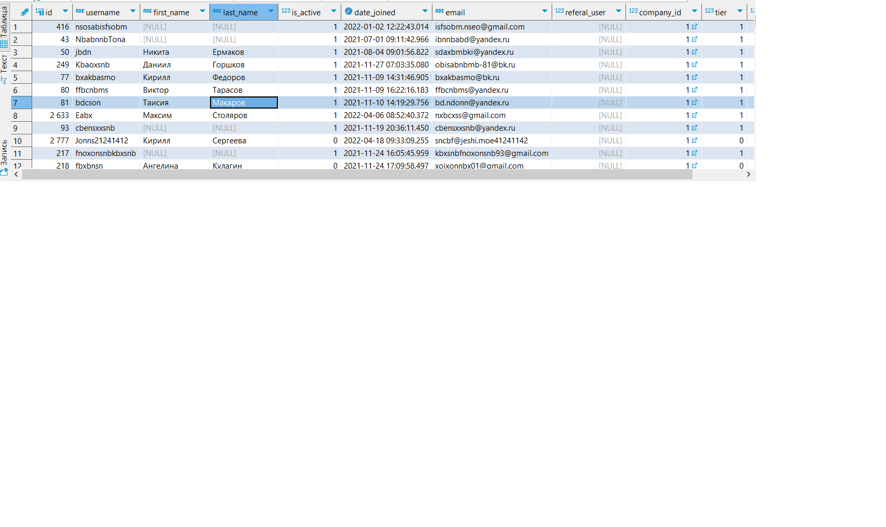
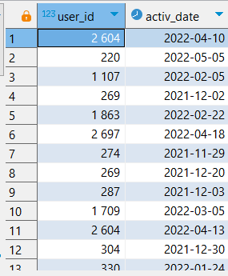
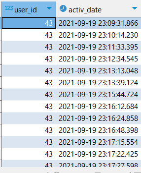
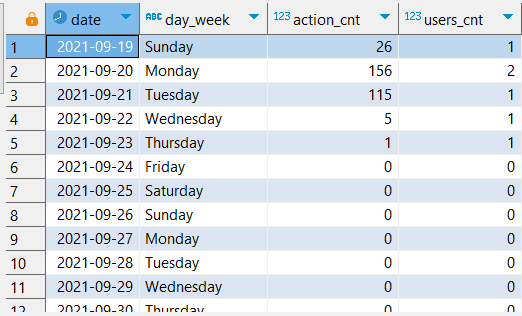
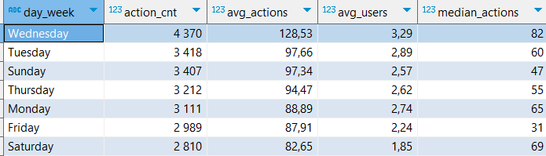
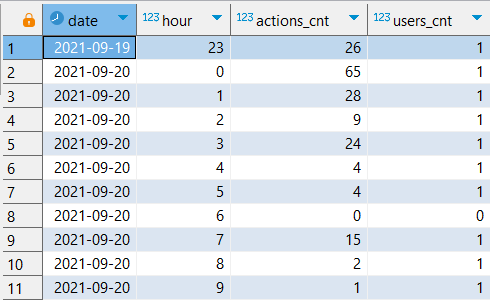
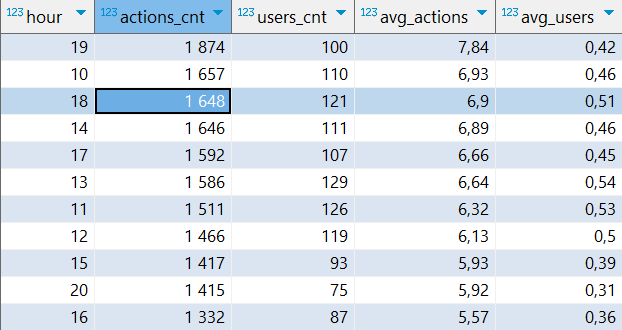
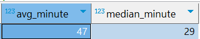
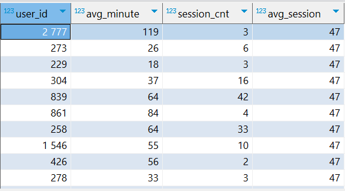

# Постановка задачи

IT Resume - платформа с задачами и тестами по программированию
Монетизация платформы строится на внутренней валюте codecoins. Её начисляют за успехи пользователя, либо её приобретают. Тратится она на открытие новых задач и тестов.
На платформе обучаются обычные пользователи, также она работает с корпоративными клиентами.
Как обычно взаимодействуют корпоративные клиенты с ITResume: им предоставляется система автоматической проверки задач. То есть, у них уже есть некоторый свой курс, и они хотели бы автоматизировать проверку задач в нем.

Часто корпоративные клиенты обращаются к платформе и просят выгрузить им то одну, то другую аналитику по своим студентам. Какие задачи решают, сколько попыток, сколько времени, какой прогресс и так далее. С разбивкой по указанным периодам.

Задача - поставить себя на место преподавателя корпоративного клиента, который очень переживает за процесс обучения своих студентов. Ему очень важно знать, какие сложности испытывают студенты, что у них получается, в каком месте нужно допилить обучающую программу и так далее. А еще поставьте себя на место финансового директора - возможно, ему будет интересно, а за что именно они нам платят деньги. А может быть еще что-то будет интересно посмотреть генеральному директору? А маркетологу? А методистам?
Затем подготовить разностороннее исследование, чтобы корпоративные клиенты платформы были довольны и все вопросы у них сразу отпали. В качестве подопытного берется клиент с id=1.

Для каждого заинтересованного лица приведу интересные для него метрики и рассчитаю их

# Что хочет знать сотрудник?

## Преподаватель 
Преподаватель хочет знать успехи каждого пользователя, чтобы точечно помогать, и в каких местах обычно возникают сложности. Помимо этого он хочет знать общие показатели пользователей, чтобы планировать нагрузку:
* Активность пользователей по дням недели и часам дня - позволит оценить нагрузку на преподавателя, например в субботу может быть много пользователей, возможно тогда преподавателю имеет смысл работать в субботу, но взять выходной в другой день.
* Средняя длительность сессии в общем и по пользователю. Если у какого-то пользователя низкая длительность сессии относительно средней, то, возможно, ему нужна помощь. 
* Какие задачи самые популярные - можно предлагать эти задачи, чтобы заинтересовать студентов
* Процент успешных попыток по задаче вообще и по пользователю  - позволяет оценить сложность задачи и прогресс студентов по ней
* Процент успешных попыток пользователя - можно оценить уровень пользователя 
* На каких задачах возникают трудности - можно узнать, с какими задачами возникают проблемы, и объяснить их подробнее
* Какое количество пользователей решает задачи разной сложности - общий уровень студентов
* Сколько и какие тесты решали
* Какие тесты решал каждый пользователь, сколько у него было правильных ответов

## Финансовый директор
В базе нет данных о затратах на доступ к платформе, поэтому буду считать, что для финансового директора важны количественные показатели платформы, т.е. сколько бонусов получает компания от взаимодействия с IT Resume.
Поэтому для него важно знать:
* Сколько всего проверок решений и сколькоо на пользователя - это можно назвать целевой метрикой для фин.директора, ведь чем больше проверок, тем более явно виден плюс автоматической проверки IT Resume, т.к. иначе каждую задачу приходилось бы проверять преподавателю  
#### Другие интересующие показатели:
* Количество задач и тестов - если их слишком мало, то и налаживать какую-то автоматическую проверку не обязательно
* Количество активных пользователей и их заходы - может быть корпопативные пользователи почти не заходят на платформу, а если и заходят, то ничего не делают
* Удержание и отток - может корпоративные студенты резко "отпадают" спустя какой-то срок (Т.к. платформа образовательная, не обязательно, чтобы пользователи заходили каждый день, поэтому буду считать rolling retention и rolling chorn rate, чтобы оценить общую вовлеченность пользователей)
Отдельно можно посмотреть на распределение codecoins, если компания напрямую закупает их для своих студентов, чтобы они эффективнее взаимодействовали с платформой. Если это так, то фин.директору также интересно:
* Общее распределение codecoins по списаниям и пополнениям
* Распределение баланса пользователей

## Генеральный директор
Его интересуют количественные показатели платформы по пользователям и контенту:
* Количество пользователей, пришедших в разные месяца
* Количество активных пользователей (по месяцам, MAU, WAU, DAU)
* Общее количество входов на платформу
* Средняя длительность сессии
* Количество заходов без активности
* Удержание и отток (Т.к. платформа образовательная, не обязательно, чтобы пользователи заходили каждый день, поэтому буду считать rolling retention и rolling chorn rate, чтобы оценить общую вовлеченность пользователей)
* Lifetime пользователя
* Сколько всего задач и тестов
* Топ 20 популярных задач
* Сколько задач было решено всего или с разбивкой по сложности или по языкам


## Маркетолог
Маркетолог хочет знать информацию, с помощью которой он может прорекламировать продукт компании другим пользователям
* Сколько всего задач с разбивкой по языкам и сложности - можно завлечь большим количеством задач
* Сколько домашних задач
* Сколько тестов
* Топ 20 популярных задач - даст возможность прорекламировать задачи, интересные пользователям
* Количество пользователей на платформе - можно показать масштаб


## Методист
Методиста, в отличии от преподавателя, интересуют усредненные успехи пользователей, чтобы он мог планировать дальнейший план обучения.
* Популярные задачи (можно смотреть на кол-во попыток решений и на количество юзеров, которые решали эту задачу)
* Сколько в среднем попыток уходит на конкретную задачу, выделить с самым большим количеством
* У каких задач низкий процент решений
* Сколько задач в среднем решает пользователь
* Какое количество пользователей решает задачи разной сложности, процент от общего кол-ва
* Какие тесты и сколько решали
* Какие тесты не решали или решали очень мало
* Средний процент правильных ответов в тесте

Подключение к базе данных (например в DBeaver):
```  
Хост: 95.163.241.236
Порт: 5432
База данных: simulative
Юзер: student
Пароль: qweasd963
```

Описание данных, которые хранят таблицы:
https://docs.google.com/document/d/1qKDKq_d8Mhud5p3mADxWWxlIrPx-EfHzvuE0j02dKtA/edit?usp=sharing

  
  
    
# Содержательная часть с описанием запросов
Просто посмотреть код SQL запросов можно в файле code в этой же папке.  
По порядку буду делать запросы по каждому интересующему вопросу и расписывать свои действия:  
Для начала я сделаю несколько CTE, к которым буду обращаться в дальнейшем. В dbeaver все запросы идут друг за другом, поэтому начало CTE with будет записан только в первом.  
Т.к. для примера я буду работать с компанией с id = 1, для начала я выберу только пользователей из этой компании:
``` 
with my_users as (
	select * 
	from users
	where company_id = 1
), 
```
Результат запроса:  
  

Также возьму активность пользователей по дням - если пользователь в какой-то день делал выгрузку запроса, проверку задания или начинал тест, то будет показана дата дня и id пользователя. Для этого через union буду извлекать id пользователя и дату действия. Т.к. union убирает дубли, каждая пара id и даты будет уникальна. При этом делаю join каждой таблицы с my_users, чтобы взять только интересующих меня пользователей
```
days_users_activity as (
	select user_id, date(created_at) as activ_date
	from coderun c
	join my_users u
	on u.id = c.user_id
	union
	select user_id, date(created_at) as activ_date
	from codesubmit c2 
	join my_users u
	on u.id = c2.user_id
	union
	select user_id, date(created_at) as activ_date
	from teststart t
	join my_users u
	on u.id = t.user_id
),
```
Результат запроса:  
 

И найду вообще всю активность пользователей с временем активности. Алгоритм похож на предыдущий, только теперь использую union all и оставляю формат даты-времени.
```
all_users_activity as (
	select user_id, created_at as activ_date
	from coderun c 
	join my_users mu on
	c.user_id = mu.id
	union all
	select user_id, created_at as activ_date
	from codesubmit c2
	join my_users mu on
	c2.user_id = mu.id
	union all
	select user_id, created_at as activ_date
	from teststart t
	join my_users mu on
	t.user_id = mu.id
),
``` 
Результат:  
 

### Активность пользователей по дням недели:
Для начала я хочу получить просто дату, день недели, количество действий, которое выполнялось в конкретный день, и количество пользователей, которые что-то делали на платформе в этот день. При этом я не хочу потерять те дни, в которых активности и пользователей вообще не было - иначе это повлияет на средние значения.
Поэтому я генерирую интервал дней, чтобы затем присоединить его join-ом и не потерять дни без активности.
Использую функцию generate_series, беря интервал от самой первой до самой последней активности вообще, и из полученного интервала с помощью функции date извлекаю дату.
```
gen_days as (
	select date(generate_series(
	(select min(activ_date) from days_users_activity), 
	(select max(activ_date) from days_users_activity),
	'1 day'::interval)) as day_date
),
```
Этот запрос я буду использовать и далее
Далее могу получить активность каждого дня. Для этого right join-ом присоединяю к таблице all_users_activity сгенерированный интервал. Группирую по дате и дню недели, и извлекаю дату, день недели, количество действий пользователей с помощью агрегатной функции count и кол-во самих пользователей, использую внутри count distinct, чтобы убрать повторы.
```
dayweek_activ as (
	select gd.day_date as date, 
	to_char(date(gd.day_date), 'Day') as day_week, 
	count(user_id) as action_cnt, -- это количество действий пользователей
	count(distinct user_id) as users_cnt -- это количество самих пользователей
	from all_users_activity ua
	right join gen_days gd
	on date(activ_date) = gd.day_date
	group by date, day_week
	order by date
),
```
Результат запроса:  
  

Теперь можно посчитать общее количество действий через sum, а также усреднить полученные значения путем группировки по дням недели и узнать среднее количество активности функцией avg. Также возьму медиану кол-ва действий, так как она менее чувствительна к выбросам и её тоже полезно смотреть.
```
avg_dayweek_activ as (
	select day_week, sum(action_cnt) as action_cnt, 
	round(avg(action_cnt), 2) as avg_actions, 
	round(avg(users_cnt), 2) as avg_users,
	percentile_disc(0.5) within group (order by action_cnt) as median_actions
	from dayweek_activ
	group by day_week
	order by avg_actions desc
),
```
Результат:  
  

Выводы:
Наибольшая активность наблюдается в среду, а самые неактивные дни в пятницу и субботу. При этом, хоть средняя активность в пятницу выше, чем в субботу, её медиана у пятницы рекордно низкая. Скорее всего было много дней, где в этот была около нулевая активность, при этом также были дни, где в пятницу активность была высока, иначе и средняя была бы низкой.
Общие выводы, что к концу недели и началу выходных большинство людей уходит отдыхать и не столь активно занимается на платформе. В воскресень, вторник и среду наибольшая активность, поэтому в эти дни у преподавателя скорее всего будет наибольшая нагрузка.

### Активность пользователей по часам дня
Как и для прошлого запроса, сгенерирую интервал дат по часам от самой первой до самой последней активности, чтобы не потерять часы без активности. Обрезаю формат даты-времени до часа с помощью функции date_trunc
```
gen_hours as (
	select date_trunc('hour', generate_series(
	(select min(activ_date) from all_users_activity),
	(select max(activ_date) from all_users_activity),
	'1 hour'::interval)) as hour
),
```
После этого получу активность каждого часа в каждом дне. Действия почти аналогичны предыдущему пункту про дни недели
```
hour_activ as (
	select date(g.hour) as date, 
	extract(hour from g.hour) as hour,
	count(user_id) as actions_cnt, 
	count(distinct user_id) as users_cnt
	from all_users_activity aua
	right join gen_hours g
	on date(g.hour) = date(aua.activ_date) 
	and extract (hour from activ_date) = extract(hour from g.hour)
	group by date, g.hour
	order by date, g.hour
)
```
Результат запроса:  


Далее группирую по часам, считаю сумму и средне действий и среднее пользователей. Медиана здесь не показательна, т.к. слишком много нулей.
```
avg_hour_activ as (
	select hour, sum(actions_cnt) as actions_cnt, sum(users_cnt) as users_cnt,
	round(avg(actions_cnt), 2) as avg_actions,
	round(avg(users_cnt),2) as avg_users
	from hour_activ
	group by hour
	order by avg_actions desc
)
```
Результат запроса:  


Вывод:  
Самые активные периоды - 10.00-15.00 и 17.00-20.00. С большим отрывом лидирует время с 19.00 до 20.00. Самые неактивные часы, как и ожидалось, ночные - с 22.00 до 6.00. С этой информацией преподавателю будет легче планировать свою нагрузку.  

### Средняя длительность сессии
Сессией буду считать цепочку действий пользователя на платформе, между которыми проходит не более 60 минут. Если прошло больше - будем считать это новой сессией. Длину сессии буду считать в минутах. Пользоваться буду созданнной ранее таблицей all_users_activity. 
Для начала с помощью оконной функции lead найду время следующей активности пользователя и разницу между текущей и следующей активностью с помощью extract(epoch). Введу "флаг" new_session, равный 0 если разница между активностью меньше 60 и 1 в ином случае. 
```
activity_timediff as (
	select *,
	lead(activ_date) over w as next_activ,
	extract(epoch from lead(activ_date) over w - activ_date)/60 as diff,
	case
		when extract(epoch from lead(activ_date) over w - activ_date)/60 <60 then 0
		else 1
	end as new_session
	from all_users_activity
	window w as (partition by user_id order by activ_date)
),
```  
Далее сделаю "маркеры" сессий, просуммировав флаги функцией sum(), используя её как оконную. Окно беру с начала до текущей строки. Это даст номер для каждой сессии пользователя. При этом, чтобы не портить разницу между активностью внутри сессии, обнуляю "переходную" активность - там, где разница между парой больше 60 минут, т.е. начинается новая сессия.  
```
session_markers AS (
    SELECT *,
    SUM(new_session) OVER (PARTITION BY user_id 
    ORDER BY activ_date ROWS BETWEEN UNBOUNDED PRECEDING AND CURRENT ROW) AS session_id,
    case 
		when diff>60 then 0
		else diff
	end as new_diff
    FROM activity_timediff
),
```  
После считаю длительность каждой сессии, суммируя все разницы между активностями внутри одной сессии через sum, группируя по user_id и session_id.
```
session_duration as (
	select user_id, session_id, sum(new_diff) as duration
	from session_markers
	group by user_id, session_id
	order by user_id, session_id
)
```  
Теперь можно получить среднюю длительность сессии в общем через avg. Также можно взять медиану через percentile_disc.
```
avg_session_duration as (
	select round(avg(duration)) as avg_minute,
	round(percentile_disc(0.5) within group (order by duration)) as median_minute
	from session_duration
)
``` 
Результат запроса:  
  

А теперь посчитаем количество сессий и ихсреднюю длительность для каждого пользователя с помощью группировки. Для удобства возьмем из предыдущей CTE среднюю длительность с помощью подзапроса.  
```
user_session_info as (
	select count(session_id) as session_cnt,
	user_id, round(avg(duration)) as avg_minute,
	(select avg_minute from avg_session_duration) as avg_session
	from session_duration
	group by user_id
)
```  
Результат запроса:  
  

### Самые популярные задачи