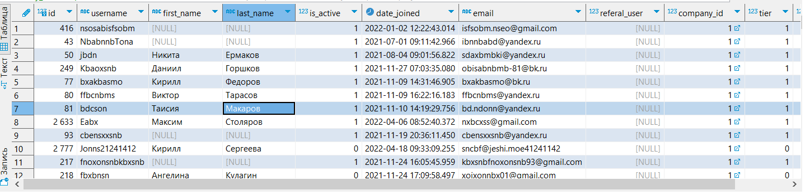
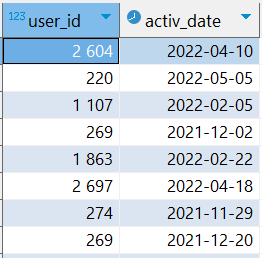
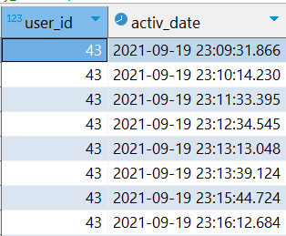

# Постановка задачи

IT Resume - платформа с задачами и тестами по программированию  
Монетизация платформы строится на внутренней валюте codecoins. Её начисляют за успехи пользователя, либо её приобретают. Тратится она на открытие новых задач и тестов.
На платформе обучаются обычные пользователи, также она работает с корпоративными клиентами.
Как обычно взаимодействуют корпоративные клиенты с ITResume: им предоставляется система автоматической проверки задач. То есть, у них уже есть некоторый свой курс, и они хотели бы автоматизировать проверку задач в нем.

Часто корпоративные клиенты обращаются к платформе и просят выгрузить им то одну, то другую аналитику по своим студентам. Какие задачи решают, сколько попыток, сколько времени, какой прогресс и так далее. С разбивкой по указанным периодам.

Задача - поставить себя на место преподавателя корпоративного клиента, который очень переживает за процесс обучения своих студентов. Ему очень важно знать, какие сложности испытывают студенты, что у них получается, в каком месте нужно допилить обучающую программу и так далее. А еще поставьте себя на место финансового директора - возможно, ему будет интересно, а за что именно они нам платят деньги. А может быть еще что-то будет интересно посмотреть генеральному директору? А маркетологу? А методистам?
Затем подготовить разностороннее исследование, чтобы корпоративные клиенты платформы были довольны и все вопросы у них сразу отпали. В качестве подопытного берется клиент с id=1.

Для каждого заинтересованного лица приведу интересные для него метрики и рассчитаю их

# Что хочет знать сотрудник?

## Преподаватель 
Преподаватель хочет знать успехи каждого пользователя, чтобы точечно помогать, и в каких местах обычно возникают сложности. Помимо этого он хочет знать общие показатели пользователей, чтобы планировать нагрузку:
* Активность пользователей по дням недели и часам дня - позволит оценить нагрузку на преподавателя, например в субботу может быть много пользователей, возможно тогда преподавателю имеет смысл работать в субботу, но взять выходной в другой день.
* Средняя длительность сессии в общем и по пользователю. Если у какого-то пользователя низкая длительность сессии относительно средней, то, возможно, ему нужна помощь. 
* Какие задачи самые популярные - можно предлагать эти задачи, чтобы заинтересовать студентов
* Процент успешных попыток по задаче  - позволяет оценить сложность задачи 
* Сколько у студента ушло попыток на решение задачи - тоже может помочь оценить на сложность задачи.
* К каким задачам приступал студент и какие он решил - покажет успех студента по задачам
* Процент успешных попыток пользователя по задаче и в общем - можно оценить уровень пользователя 
* На каких задачах возникают трудности - можно узнать, с какими задачами возникают проблемы, и объяснить их подробнее
* Какое количество пользователей решает задачи разной сложности - общий уровень студентов
* Сколько и какие тесты решали
* Какие тесты решал каждый пользователь, сколько у него было правильных ответов

## Финансовый директор
В базе нет данных о затратах на доступ к платформе, поэтому буду считать, что для финансового директора важны количественные показатели платформы, т.е. сколько бонусов получает компания от взаимодействия с IT Resume.
Поэтому для него важно знать:
* Сколько всего проверок решений и сколькоо на пользователя - это можно назвать целевой метрикой для фин.директора, ведь чем больше проверок, тем более явно виден плюс автоматической проверки IT Resume, т.к. иначе каждую задачу приходилось бы проверять преподавателю  
#### Другие интересующие показатели:
* Количество задач и тестов - если их слишком мало, то и налаживать какую-то автоматическую проверку не обязательно
* Количество активных пользователей и их заходы - может быть корпопативные пользователи почти не заходят на платформу, а если и заходят, то ничего не делают
* Удержание и отток - может корпоративные студенты резко "отпадают" спустя какой-то срок (Т.к. платформа образовательная, не обязательно, чтобы пользователи заходили каждый день, поэтому буду считать rolling retention и rolling chorn rate, чтобы оценить общую вовлеченность пользователей)
Отдельно можно посмотреть на распределение codecoins, если компания напрямую закупает их для своих студентов, чтобы они эффективнее взаимодействовали с платформой. Если это так, то фин.директору также интересно:
* Общее распределение codecoins по списаниям и пополнениям
* Распределение баланса пользователей

## Генеральный директор
Его интересуют количественные показатели платформы по пользователям и контенту:
* Количество пользователей, пришедших в разные месяца
* Количество активных пользователей (по месяцам, MAU, WAU, DAU)
* Общее количество входов на платформу
* Средняя длительность сессии
* Количество заходов без активности
* Удержание и отток (Т.к. платформа образовательная, не обязательно, чтобы пользователи заходили каждый день, поэтому буду считать rolling retention и rolling chorn rate, чтобы оценить общую вовлеченность пользователей)
* Lifetime пользователя
* Сколько всего задач и тестов
* Топ 20 популярных задач
* Сколько задач было решено всего или с разбивкой по сложности или по языкам


## Маркетолог
Маркетолог хочет знать информацию, с помощью которой он может прорекламировать продукт компании другим пользователям
* Сколько всего задач с разбивкой по языкам и сложности - можно завлечь большим количеством задач
* Сколько домашних задач
* Сколько тестов
* Топ 20 популярных задач - даст возможность прорекламировать задачи, интересные пользователям
* Количество пользователей на платформе - можно показать масштаб


## Методист
Методиста, в отличии от преподавателя, интересуют усредненные успехи пользователей, чтобы он мог планировать дальнейший план обучения.
* Популярные задачи (можно смотреть на кол-во попыток решений и на количество юзеров, которые решали эту задачу)
* Количество и процент успешно решенных/нерешенных в итоге задач
* Сколько в среднем попыток на задачу определенной сложности или ЯП, если задача была выполнена
* Сколько в среднем попыток уходит на конкретную задачу, выделить с самым большим количеством
* У каких задач низкий процент решений
* Есть ли задачи, которые вообще не трогали  
* Сколько задач в среднем решает пользователь
* Какое количество пользователей решает задачи разной сложности, процент от общего кол-ва
* Какие тесты и сколько решали
* Какие тесты не решали или решали очень мало
* Средний процент правильных ответов в тесте

Подключение к базе данных (например в DBeaver):
```  
Хост: 95.163.241.236
Порт: 5432
База данных: simulative
Юзер: student
Пароль: qweasd963
```

Описание данных, которые хранят таблицы:
https://docs.google.com/document/d/1qKDKq_d8Mhud5p3mADxWWxlIrPx-EfHzvuE0j02dKtA/edit?usp=sharing

  


# Содержательная часть с описанием запросов
Просто посмотреть код SQL запросов можно в файле code в этой же папке.  
По порядку буду делать запросы по каждому интересующему вопросу и расписывать свои действия:  
Для начала я сделаю несколько CTE, к которым буду обращаться в дальнейшем. В dbeaver мои запросы записаны друг за другом, поэтому начало CTE with будет записан только в первом.  
Т.к. для примера я буду работать с компанией с id = 1, для начала я выберу только пользователей из этой компании:
``` 
with my_users as (
	select * 
	from users
	where company_id = 1
), 
```
Результат запроса:  
  

Также возьму активность пользователей по дням - если пользователь в какой-то день делал выгрузку запроса, проверку задания или начинал тест, то будет показана дата дня и id пользователя. Для этого через union буду извлекать id пользователя и дату действия. Т.к. union убирает дубли, каждая пара id и даты будет уникальна. При этом делаю join каждой таблицы с my_users, чтобы взять только интересующих меня пользователей
```
days_users_activity as (
	select user_id, date(created_at) as activ_date
	from coderun c
	join my_users u
	on u.id = c.user_id
	union
	select user_id, date(created_at) as activ_date
	from codesubmit c2 
	join my_users u
	on u.id = c2.user_id
	union
	select user_id, date(created_at) as activ_date
	from teststart t
	join my_users u
	on u.id = t.user_id
),
```
Результат запроса:  
 

И найду вообще всю активность пользователей с временем активности. Алгоритм похож на предыдущий, только теперь использую union all и оставляю формат даты-времени.
```
all_users_activity as (
	select user_id, created_at as activ_date
	from coderun c 
	join my_users mu on
	c.user_id = mu.id
	union all
	select user_id, created_at as activ_date
	from codesubmit c2
	join my_users mu on
	c2.user_id = mu.id
	union all
	select user_id, created_at as activ_date
	from teststart t
	join my_users mu on
	t.user_id = mu.id
),
``` 
Результат:  
 

### Активность пользователей по дням недели:
Для начала я хочу получить просто дату, день недели, количество действий, которое выполнялось в конкретный день, и количество пользователей, которые что-то делали на платформе в этот день. При этом я не хочу потерять те дни, в которых активности и пользователей вообще не было - иначе это повлияет на средние значения.
Поэтому я генерирую интервал дней, чтобы затем присоединить его join-ом и не потерять дни без активности.
Использую функцию generate_series, беря интервал от самой первой до самой последней активности вообще, и из полученного интервала с помощью функции date извлекаю дату.
```
gen_days as (
	select date(generate_series(
	(select min(activ_date) from days_users_activity), 
	(select max(activ_date) from days_users_activity),
	'1 day'::interval)) as day_date
),
```
Этот запрос я буду использовать и в дальнейшем.  
Далее могу получить активность каждого дня. Для этого right join-ом присоединяю к таблице all_users_activity сгенерированный интервал. Группирую по дате и дню недели, и извлекаю дату, день недели, количество действий пользователей с помощью агрегатной функции count и кол-во самих пользователей, использую внутри count distinct, чтобы убрать повторы.
```
dayweek_activ as (
	select gd.day_date as date, 
	to_char(date(gd.day_date), 'Day') as day_week, 
	count(user_id) as action_cnt, -- это количество действий пользователей
	count(distinct user_id) as users_cnt -- это количество самих пользователей
	from all_users_activity ua
	right join gen_days gd
	on date(activ_date) = gd.day_date
	group by date, day_week
	order by date
),
```
Результат запроса:  
  

Теперь можно посчитать общее количество действий через sum, а также усреднить полученные значения путем группировки по дням недели и узнать среднее количество активности функцией avg. Также возьму медиану кол-ва действий, так как она менее чувствительна к выбросам и её тоже полезно смотреть.
```
avg_dayweek_activ as (
	select day_week, sum(action_cnt) as action_cnt, 
	round(avg(action_cnt), 2) as avg_actions, 
	round(avg(users_cnt), 2) as avg_users,
	percentile_disc(0.5) within group (order by action_cnt) as median_actions
	from dayweek_activ
	group by day_week
	order by avg_actions desc
),
```
Результат:  
  

#### Выводы:
Наибольшая активность наблюдается в среду, а самые неактивные дни в пятницу и субботу. При этом, хоть средняя активность в пятницу выше, чем в субботу, её медиана у пятницы рекордно низкая. Скорее всего было много дней, где в этот была около нулевая активность, при этом также были дни, где в пятницу активность была высока, иначе и средняя была бы низкой.
Общие выводы, что к концу недели и началу выходных большинство людей уходит отдыхать и не столь активно занимается на платформе. В воскресень, вторник и среду наибольшая активность, поэтому в эти дни у преподавателя скорее всего будет наибольшая нагрузка.

### Активность пользователей по часам дня
Как и для прошлого запроса, сгенерирую интервал дат по часам от самой первой до самой последней активности, чтобы не потерять часы без активности. Обрезаю формат даты-времени до часа с помощью функции date_trunc
```
gen_hours as (
	select date_trunc('hour', generate_series(
	(select min(activ_date) from all_users_activity),
	(select max(activ_date) from all_users_activity),
	'1 hour'::interval)) as hour
),
```
После этого получу активность каждого часа в каждом дне. Действия почти аналогичны предыдущему пункту про дни недели
```
hour_activ as (
	select date(g.hour) as date, 
	extract(hour from g.hour) as hour,
	count(user_id) as actions_cnt, 
	count(distinct user_id) as users_cnt
	from all_users_activity aua
	right join gen_hours g
	on date(g.hour) = date(aua.activ_date) 
	and extract (hour from activ_date) = extract(hour from g.hour)
	group by date, g.hour
	order by date, g.hour
)
```
Результат запроса:  


Далее группирую по часам, считаю сумму и средне действий и среднее пользователей. Медиана здесь не показательна, т.к. слишком много нулей.
```
avg_hour_activ as (
	select hour, sum(actions_cnt) as actions_cnt, sum(users_cnt) as users_cnt,
	round(avg(actions_cnt), 2) as avg_actions,
	round(avg(users_cnt),2) as avg_users
	from hour_activ
	group by hour
	order by avg_actions desc
)
```
Результат запроса:  


#### Выводы  
Самые активные периоды - 10.00-15.00 и 17.00-20.00. С большим отрывом лидирует время с 19.00 до 20.00. Самые неактивные часы, как и ожидалось, ночные - с 22.00 до 6.00. С этой информацией преподавателю будет легче планировать свою нагрузку.  

### Средняя длительность сессии
Сессией буду считать цепочку действий пользователя на платформе, между которыми проходит не более 60 минут. Если прошло больше - будем считать это новой сессией. Длину сессии буду считать в минутах. Пользоваться буду созданнной ранее таблицей all_users_activity. 
Для начала с помощью оконной функции lead найду время следующей активности пользователя и разницу между текущей и следующей активностью с помощью extract(epoch). Введу "флаг" new_session, равный 0 если разница между активностью меньше 60 и 1 в ином случае. 
```
activity_timediff as (
	select *,
	lead(activ_date) over w as next_activ,
	extract(epoch from lead(activ_date) over w - activ_date)/60 as diff,
	case
		when extract(epoch from lead(activ_date) over w - activ_date)/60 <60 then 0
		else 1
	end as new_session
	from all_users_activity
	window w as (partition by user_id order by activ_date)
),
```

Далее сделаю "маркеры" сессий, просуммировав флаги функцией sum(), используя её как оконную. Окно беру с начала до текущей строки. Это даст номер для каждой сессии пользователя. При этом, чтобы не портить разницу между активностью внутри сессии, обнуляю "переходную" активность - там, где разница между парой больше 60 минут, т.е. начинается новая сессия.  
```
session_markers AS (
    SELECT *,
    SUM(new_session) OVER (PARTITION BY user_id 
    ORDER BY activ_date ROWS BETWEEN UNBOUNDED PRECEDING AND CURRENT ROW) AS session_id,
    case 
		when diff>60 then 0
		else diff
	end as new_diff
    FROM activity_timediff
),
```
Результат запроса:  
  

После считаю длительность каждой сессии, суммируя все разницы между активностями внутри одной сессии через sum, группируя по user_id и session_id.
```
session_duration as (
	select user_id, session_id, sum(new_diff) as duration
	from session_markers
	group by user_id, session_id
	order by user_id, session_id
)
```  
Теперь можно получить среднюю длительность сессии в общем через avg. Также можно взять медиану через percentile_disc.
```
avg_session_duration as (
	select round(avg(duration)) as avg_minute,
	round(percentile_disc(0.5) within group (order by duration)) as median_minute
	from session_duration
)
``` 
Результат запроса:  
  

А теперь посчитаем количество сессий и их среднюю длительность для каждого пользователя с помощью группировки. Для удобства возьмем из предыдущей CTE среднюю длительность с помощью подзапроса.  
```
user_session_info as (
	select user_id, 
	count(session_id) as session_cnt,
	round(avg(duration)) as avg_minute,
	(select avg_minute from avg_session_duration) as avg_session_dur
	from session_duration
	group by user_id
)
```  
Результат запроса:  
  

Помимо этого, можно посмотреть распределение длительностей сессий по перцентилям с шагом 0.1. Для этого использую generate_series(0.1, 1, 0.1), названный как perc, и команду percentile_cont.
```
duration_percentile as (
	select perc, percentile_cont(perc) within group (order by avg_minute) as duration 
	from user_session_info, pg_catalog.generate_series(0.1, 1, 0.1) perc
	group by perc
),
```  
Результат запроса:  
  

#### Итоги
Теперь преподаватель может видеть заинтересованность каждого пользователя, смотря на его среднюю длительность сессии или на каждую сессию в отдельности. Также он может посмотреть, в какой "когорте" находится пользователь по длительности. Если с низкой длительносью - возможно у пользователя возникают какие-то трудности с использованием платформы или с самими заданиями и преподаватель может помочь это исправить.  

### Самые популярные задачи  
Популярность буду оценивать по двум критериям - количество пользователей, которые пытались решить эту задачу (таблица codesubmit) и сколько раз вообще пользователь взаимодействовал с задачей (запуск кода и проверка решения, таблицы coderun и codesubmit).
Для первого критерия объединю таблицы codesubmit и my_users обычным join-ом, таблицу problem right join-ом, чтобы не потерять те задачи, которые вообще не решали, и таблицы languagetoproblem и language. Извлеку из полученной таблицы problem_id, complexity (сложность), название задания, язык програмирования для задачи, количество пользователей, которые пытались решить эту задачу, процент верных попыток, который буду искать через case и ранг задачи по кол-ву пользователей. Отсортирую по количеству пользователей.
```
problems_info as (
	select p.id as problem_id, 
	complexity, 
	p.name, 
	lg.name as lang,
	count(distinct user_id) as users_cnt,
	round(count(case when is_false = 0 then 1 end)*100.0/count(*),2) as perc_right,
	rank() over (order by count(distinct user_id) desc) as rank_in_users
	from codesubmit c 
	join my_users mu
	on c.user_id = mu.id
	right join problem p 
	on p.id = c.problem_id
	join languagetoproblem l  
	on l.pr_id = p.id
	join language lg
	on lg.id = l.lang_id
	where is_visible is true  -- чтобы пользователи видели эти задачи
	group by p.id, complexity, p.name, lg.name
	order by users_cnt desc
)
```  
Результат запроса:  
  

Второй критерий - количество взаимодействий пользователя с задачей. Этот показатель тоже покажет, какие задачи популярные - может быть их не выставляли на проверку, т.к. не получалось, но при этом много работали с ней, потому что она интересная и т.д.
В запросе для начала объединяю таблицы codesubmit и coderun через union all, записываю это в CTE problem_starts.  
Далее к этой таблице присоединяю right join-ом problem, а затем languagetoproblem и language. Извлекаю problem_id, сложность, название задачи, язык программирования, кол-во "активаций" задачи и ранг по активациям. Ранг получаю для того, чтобы потом объединить starts_count и problems_info и сравнить полученные результаты - задачи с наибольшим кол-вом пользователей также и самые "трогаемые", или нет.
```
problem_starts as (
	select problem_id 
	from coderun cr
	join my_users mu
	on mu.id = cr.user_id
	union all
	select problem_id
	from codesubmit cs
	join my_users mu
	on mu.id = cs.user_id
),
starts_count as (
	select problem_id, 
	complexity, 
	p.name, 
	lg.name,
	count(problem_id) as starts_cnt,
	rank() over (order by count(problem_id) desc) as starts_rank
	from problem_starts ps
	right join problem p
	on p.id = ps.problem_id
	join languagetoproblem l  
	on l.pr_id = p.id
	join language lg
	on lg.id = l.lang_id
	group by problem_id, complexity, p.name, lg.name
)
```  
Результат запроса:  
   

Теперь можно объединить эти запросы и поискать самые популярные задачи по этим критериям. Я считаю, что кол-во пользователей, которые пытались решить задачу, важнее, поэтому сортирую по ней. Но с помощью второго критерия можно более правильно отранжировать задачи, например, если по кол-ву пользователей задачи мало отличаются, но у второй значительно больше активаций, то поставим её выше.
```
problems_rank as (
	select sc.problem_id, 
	sc.name,
	sc.complexity,
	sc.lang, 
	rank_in_users, starts_rank
	from starts_count  sc
	join problems_info p
	on sc.problem_id = p.problem_id
	order by rank_in_users, starts_rank
	limit 20
)
```  
Результат запроса:  
  

Дополнительно можно фильтровать по сложности, языку или домашнему/не домашнему.  

#### Выводы
Cамые популярные задачи - по SQL первой сложности, в основном это дз. Если убрать дз - то ранг по пользователям сильно падает, и в таком случае самые популярные - тестовое задание в альфа-банк с SQL и некоторые задачи на python. Если смотреть в разрезе языка, то python менее популярен, самые популярные у него это также дз.  

### Процент успешных попыток по задаче
Процент успешных попыток по задаче по всем решениям я уже получал в CTE problems_info.  
 

### Сколько у студента ушло попыток на решение задачи
Т.е. какая по очередности попытка была первой правильной.  
Для начала я объединю таблицу codesubmit с my_users. Возьму id пользователя, задачи, параметр is_false и через оконную функцию номер строки, сортируя по дате (т.е. по очередности).
```
rank_codesubmit as (
	select user_id, 
	problem_id, 
	is_false,
	row_number() over (partition by user_id, problem_id order by created_at) as row_num
	from codesubmit c 
	join my_users mu
	on c.user_id = mu.id
	order by user_id, created_at 
),
```  
Далее из полученной таблицы возьму только те строки, где is_false = 0 (т.е успешные попытки), сгруппирую по id пользователя и задачи и возьму минимальный номер строки, тем самым получив номер первой успешной попытки.
```
min_user_attempts as (
	select user_id, problem_id,
	min(row_num) as right_attempt
	from rank_codesubmit
	where is_false = 0
	group by user_id, problem_id
),
```  
Результат запроса:  
   
#### Итог
Преподаватель сможет посмотреть, насколько легко или тяжело у студента получилась та или иная задача.

### К каким задачам приступал студент и какие он решил  
Объединим таблицу codesubmit и my_users. Сгруппирую по user_id, username, problem_id. Извеку id пользователя, его ник, id проблемы, и булево значение done, равное True, если задача хоть один раз была решена правильно.
```
user_problems as (
	select user_id, username, problem_id,
	case when min(is_false) = 0 then true else false end as done
	from codesubmit c 
	join my_users mu
	on c.user_id = mu.id
	group by user_id, username, problem_id
	order by user_id, problem_id
),
```  
Результат запроса:  
  

Дополнительно к этому запросу можно посчитать сколько всего задач он пытался решить и сколько в итоге решил.
Для этого использую функцию count как оконную, считая кол-во задач, кол-во решенных задач через case и нахожу процент от общего числа.
```
user_problems_info as (
	select *,
	count(problem_id) over w as cnt_problems,
	count(case when done is true then 1 end) over w as cnt_right,
	round(count(case when done is true then 1 end) over w *100.0/count(problem_id) over w) as "right (%)"
	from user_problems
	window w as (partition by user_id)
),
```
Результат запроса:  
  

#### Итог  
Теперь преподаватель сможет оценить успехи каждого студента в разрезе каждой задачи и в общем.  

### Процент успешных попыток пользователя по задаче и в общем  
Для нахождения процента успешных попыток для каждой задачи опять присоединяю к codesubmit таблицу my_users. Группирую по id пользователя и проблемы, извлекаю user_id, problem_id, кол-во верных попыток, кол-во всех попыток и отношение первого ко второму в процентах. Это позволит посмотреть, как хорошо пользователь решает задачи.
```
user_attempts_to_problem as (
	select user_id, problem_id,
	count(case when is_false = 0 then 1 end) as right_attempt_cnt,
	count(*) as attempt_cnt,
	round(count(case when is_false = 0 then 1 end)*100.0/count(*), 2) as "right (%)"
	from codesubmit c
	join my_users mu
	on c.user_id = mu.id
	group by user_id, problem_id
),
```  
Результат запроса:  
  

Теперь можно усреднить эти значения, сгруппировав по пользователю
```
user_avg_right_attempt as (
	select user_id, 
	round(avg("right (%)"), 2) as "right (%)"
	from user_attempts_to_problem
	group by user_id
),
```
Результат запроса:  
  

#### Итог
Теперь преподаватель может на успешность пользователя, и помогать, если видно, что возникают трудности. Например, топ 5 студентов с самым низким процентом успеха это 43, 1178, 589, 1217, 2643.

### На каких задачах возникают трудности
ОТСЮДА
Посмотрим, на какие задачи уходит больше всего попыток и у каких задач низкий уровень правильных ответов  
Для изучения среднего кол-ва попыток для решения задачи обращусь к ранее созданной таблице min_user_attempts, сгруппирую по задаче и получу среднее через avg, округляя до целого.
```
avg_attempts_for_problem as (
	select problem_id, round(avg(right_attempt), 2) as avg_attempt
	from min_user_attempts
	group by problem_id
),
```   
Результат запроса:  
  

Далее к этой таблице можно присоединить problems_info:  
```
problems_attempts_info as (
	select atp.*, pi.perc_right,
	pi.users_cnt, pi.name, 
	pi.complexity, pi.lang
	from avg_attempts_for_problem atp
	JOIN problems_info pi
	ON pi.problem_id = atp.problem_id
	),
```  
Убирая те задачи, на которых было меньше 3-х человек (чтобы иметь хоть какую-то статистику) и сортируя по кол-ву попыток для решения, получим:
  
Сортируя по проценту правильных решений:
  
#### Вывод
Топ 8 задач в каждой сортировке занимают задачи на python. Возможно, методистам стоит изменить блок объяснения питона, а преподавателю быть готовым к большей работе с учениками по этому блоку.  


