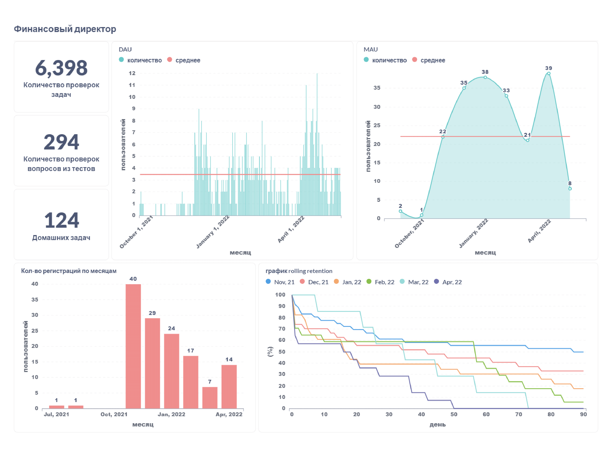
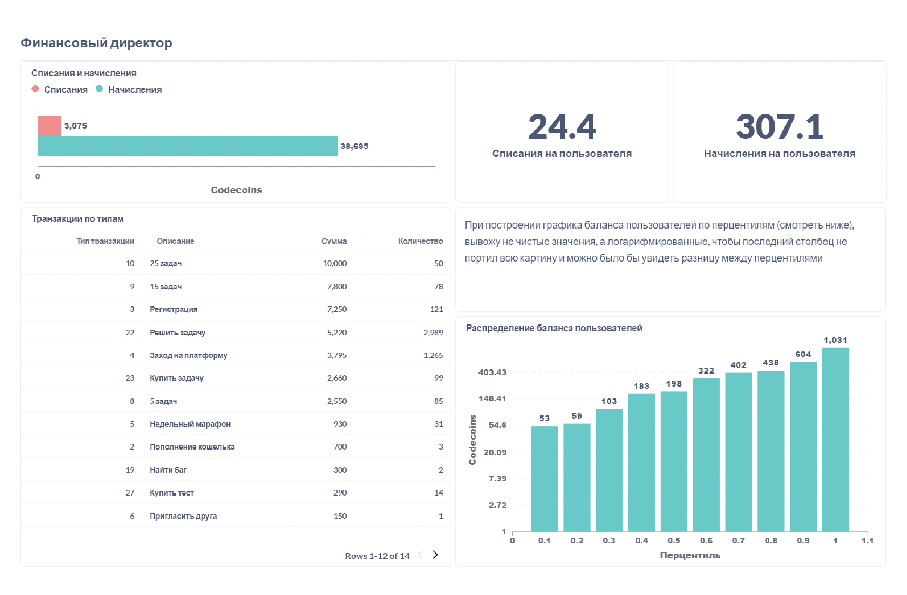

Обратно к [task_and_work](../../task_and_work.md)  

В дашборде два листа. На фото показаны значения с фильтром по компании с id = 1.  
На первом листе приведена информация о проверках (т.к. проверки я посчитал ключевой метрикой) и о пользовательской активности. В графиках с активностью дана активность за период (день/месяц) и среднее число пользователей за весь показанный промежуток (красная линия). Ниже я разместил график rolling retention для оценки ухода пользователей с платформы. 
  

На втором листе - информация о транзакциях внутренней валюты codecoins. Тут я показываю распределение по каждому типу транзакции и в общем по списаниям/начислениям. Также даны среднее списание/начисление на пользователя, и баланс пользователей по перцентилям с помощью стоблчатой диаграммы. 
  

