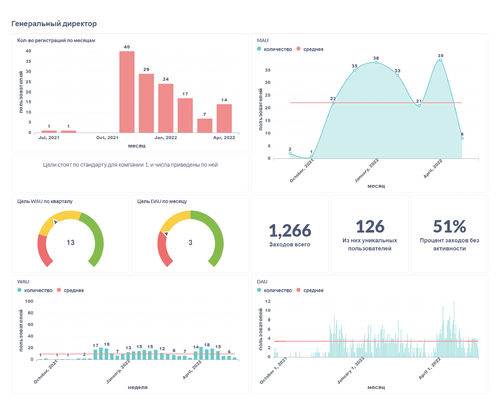
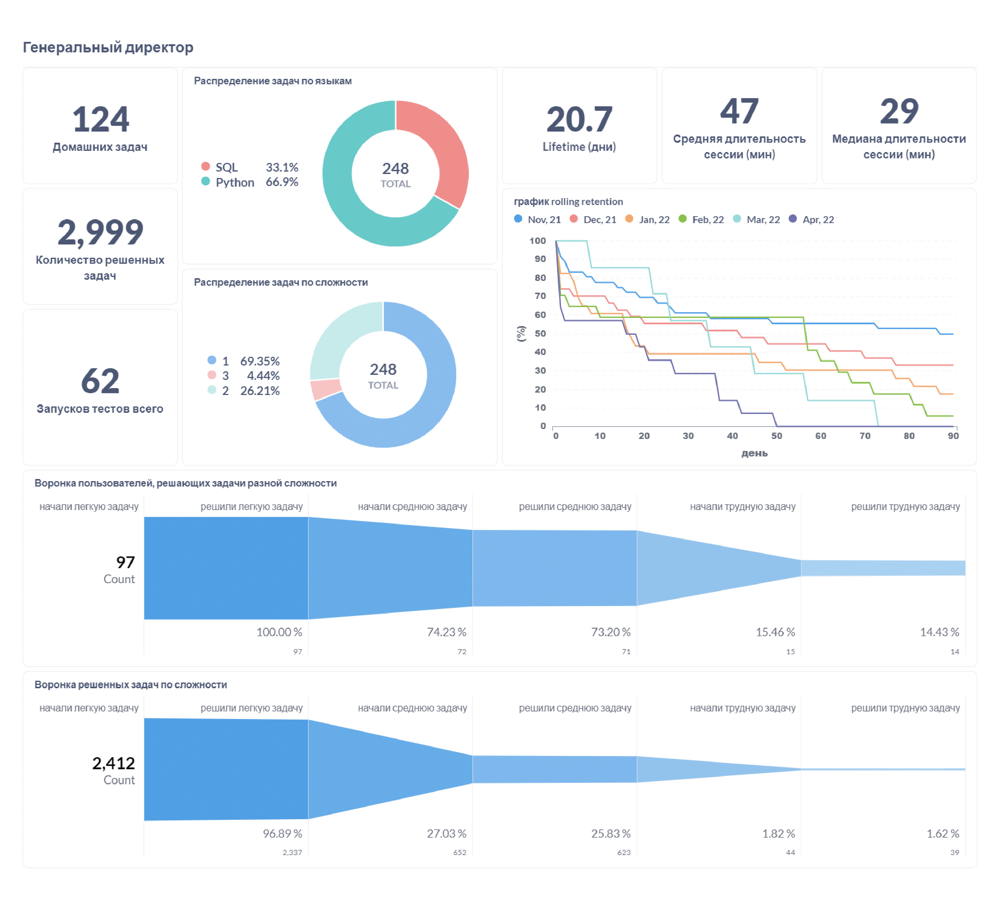
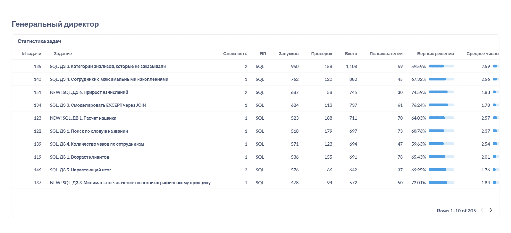

Обратно к [task_and_work](../../task_and_work.md)  

В дашборде три листа. На фото показаны значения с фильтром по компании с id = 1.  
Первый лист даёт информацию о регистрациях и активности пользователей на платформе. В графиках с активностью дана активность за период (месяц/неделя/день) и среднее число пользователей за весь показанный промежуток (красная линия). Дополнительно разместил "цели" для wau и dau, а также общее число заходов, пользователей и какой процент заходов не сопровождается активностью (т.е. пользователь зашел, но больше ничего не делал)  
  

На втором листе приведена информация о задачах и "жизни" клиента. Сколько задач домашних или по разной сложности/языку, сколько вообще решили, сколько тестов делали. Показан lifetime пользователя, средняя длительность сессии, её медина, и график rolling retention по когортам.  
Ниже я разместил две воронки успехов пользователей по решении задач разной сложности. На первой показан процент пользователей, на второй - процент запусков кода.  
  

На третьем листе размещена таблица со статистикой задач. Я отсортировал её по убыванию кол-ва запусков и проверок (столбец всего), так генеральный директор может посмотреть на самые популярные задачи. При желании он может отфильтровать по сложности, языку или посмотреть на конкретные задачи.  
  

