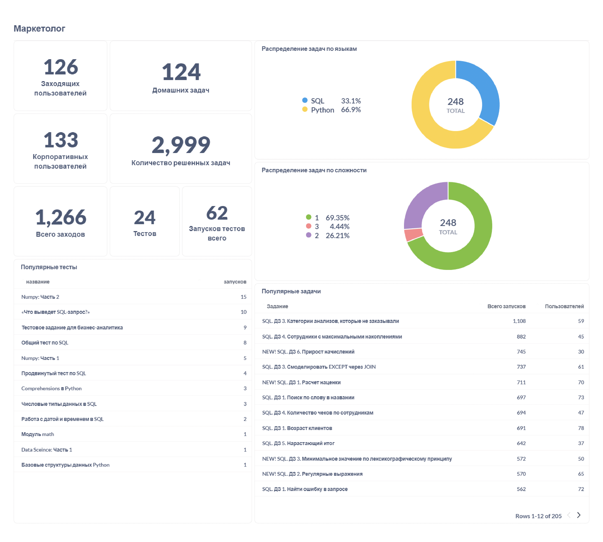

Обратно к [task_and_work](../../task_and_work.md)  

В основном в дашборде будут числовые показатели, которые маркетолог может прорекламировать. Это кол-во задач с разбивкой по языкам и сложности, сколько пользователей, заходов, задач и т.д. Помимо этого я указал самые популярные тесты и задачи.
  

