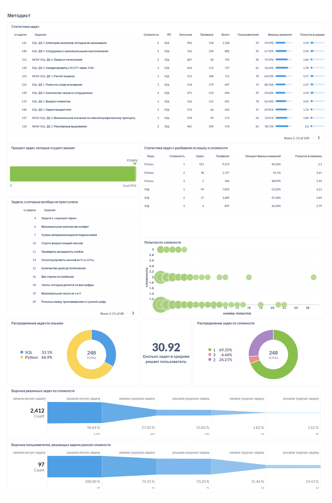
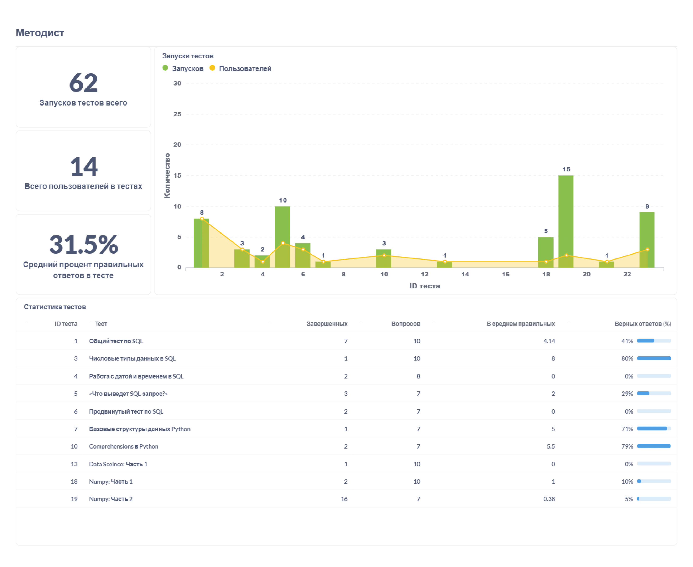

Обратно к [task_and_work](../../task_and_work.md)  

В дашборде два листа. На фото показаны значения с фильтром по компании с id = 1.  
Т.к. методиста интересует в основном статистика по решениям задач и тестов, то первый лист я посвящаю информации по задачам: статистика в общем, по сложности, усредненными успехи студентов, кол-во попыток по сложности и т.д. Дополнительно привожу список тех задач, которые студенты вообще не пытались решить, и воронки решений задач разной сложности по запускам кода и по пользователям.  
   

Второй лист посвящен тестам: сколько их запускали, сколько пользователей их решало, график с разбивкой по тестам, средний процент верных ответов, статистика по тестам. 
  

