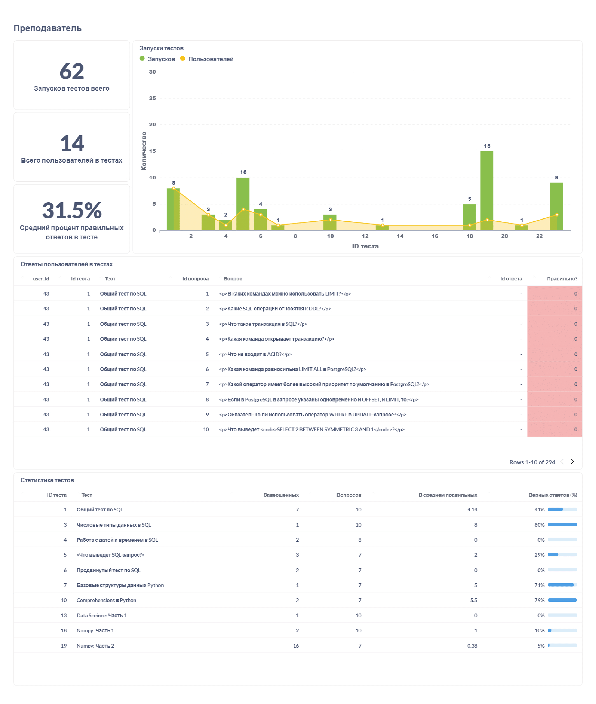

Обратно к [task_and_work](../../task_and_work.md)  

В дашборде три листа. На фото показаны значения с фильтром по компании с id = 1.  
На первом дана общая информация активность пользователей, кол-во задач на разных языках или сложности, а также более конкретная статистика по задачам - с помощью пузырьковой диаграммы показано влияние сложности задачи на минимальное число попыток для её решения, а также таблица с информацией по задачам - названию, сложности, кол-ву запусков, проверок, процент успешных проверок и сколько в среднем уходит попыток на эту задачу.  
  

Второй лист посвящен клиентам - на нём дана таблица со статистикой по клиентам: его email, дата регистрации, сколько раз он запускал свой код или отправлял его на проверку, сколько решений было правильным, сколько задач решил, количество попыток в среднем, его компания, сколько доступно для студента ДЗ, и какой процент он уже выполнил.  
Дополнительно приведена таблица сводная таблица, на которой показано, какие задачи студент решил (отмечены 1 зеленым цветом), пытался решить (отмечены 0 желтым) или даже не приступал (прочерк красным).  
  

  

