# Постановка задачи

IT Resume - платформа с задачами и тестами по программированию  
Монетизация платформы строится на внутренней валюте codecoins. Её начисляют за успехи пользователя, либо её приобретают. Тратится она на открытие новых задач и тестов.  
На платформе обучаются обычные пользователи, также она работает с корпоративными клиентами.  
Как обычно взаимодействуют корпоративные клиенты с ITResume: им предоставляется система автоматической проверки задач. То есть, у них уже есть некоторый свой курс, и они хотели бы автоматизировать проверку задач в нем.  

Часто корпоративные клиенты обращаются к платформе и просят выгрузить им то одну, то другую аналитику по своим студентам. Какие задачи решают, сколько попыток, сколько времени, какой прогресс и так далее. С разбивкой по указанным периодам.  

Задача - поставить себя на место преподавателя корпоративного клиента, который очень переживает за процесс обучения своих студентов. Ему очень важно знать, какие сложности испытывают студенты, что у них получается, в каком месте нужно допилить обучающую программу и так далее. А еще поставьте себя на место финансового директора - возможно, ему будет интересно, а за что именно они нам платят деньги. А может быть еще что-то будет интересно посмотреть генеральному директору? А маркетологу? А методистам?  
Затем подготовить разностороннее исследование, чтобы корпоративные клиенты платформы были довольны и все вопросы у них сразу отпали. В качестве подопытного берется клиент с id=1 (компания Клиент 1).  
 
Для каждого заинтересованного лица приведу интересные (по моему мнению) для него метрики и рассчитаю их.  
Некоторые метрики повторяются, поэтому ссылка может ввести в блок другого человека, в котором я уже давал ответ на поставленный вопрос.  

Также для каждого сотрудника я создам дашборд с интересующими его метриками. Делать я это буду в metabase через sql запросы. В дашборде будут доступны фильтры по периоду, id компании, задачам и т.д., в зависимости от метрик. Изначально практически все данные будут показывать информацию по всем студентам, не только из компании с id = 1.  
Пример Дашборда:
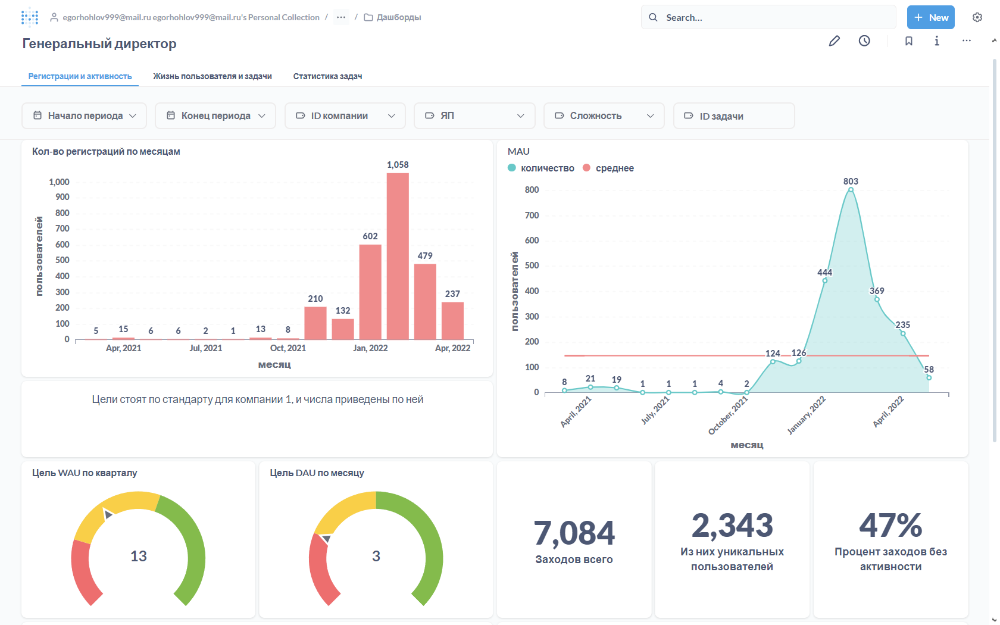  

# Что хочет знать сотрудник?

## [Преподаватель](#блок-преподавателя)
[Дашборд преподавателя](Dashboards/Teacher/README.md)  
Преподаватель хочет знать успехи каждого пользователя, чтобы точечно помогать, и в каких местах обычно возникают сложности. Помимо этого он хочет знать общие показатели пользователей, чтобы планировать нагрузку:
* [Активность пользователей по дням недели и часам дня](#активность-пользователей-по-дням-недели) - позволит оценить нагрузку на преподавателя, например в субботу может быть много пользователей, возможно тогда преподавателю имеет смысл работать в субботу, но взять выходной в другой день.
* [Длительность сессии](#средняя-длительность-сессии) в общем и по пользователю. Если у какого-то пользователя низкая длительность сессии относительно средней, то, возможно, ему нужна помощь. 
* [Какие задачи самые популярные](#самые-популярные-задачи) - можно предлагать эти задачи, чтобы заинтересовать студентов
* [Процент успешных попыток по задаче](#процент-успешных-попыток-по-задаче)  - позволяет оценить сложность задачи 
* [Сколько у студента ушло попыток на решение задачи](#сколько-у-студента-ушло-попыток-на-решение-задачи) - тоже может помочь оценить сложность задачи.
* [К каким задачам приступал студент и какие он решил](#к-каким-задачам-приступал-студент-и-какие-он-решил) - покажет успех студента по задачам
* [Процент успешных попыток пользователя по задаче и в общем](#процент-успешных-попыток-пользователя-по-задаче-и-в-общем) - можно оценить уровень пользователя 
* [На каких задачах возникают трудности](#на-каких-задачах-возникают-трудности) - можно узнать, с какими задачами возникают проблемы, и объяснить их подробнее
* [Какое количество пользователей решает задачи разной сложности и разных языков](#какое-количество-пользователей-решает-задачи-разной-сложности-и-разных-языков) - общий уровень студентов
* [Сколько раз приступали к каждому тесту](#сколько-раз-приступали-к-каждому-тесту)
* [Сколько раз отдельный студент начинал тест](#сколько-раз-отдельный-студент-начинал-тест)
* [Какие тесты решал каждый пользователь, сколько у него было правильных ответов](#какие-тесты-решал-каждый-пользователь-сколько-у-него-было-правильных-ответов)
* [Какие ответы давал пользователь в тесте](#какие-ответы-давал-пользователь-в-тесте)
* [Статистика прохождений тестов](#статистика-прохождений-тестов)

## [Финансовый директор](#блок-финансового-директора)
[Дашборд финансового директора](Dashboards/Finance_Director/README.md)  
В базе нет данных о затратах на доступ к платформе, поэтому буду считать, что для финансового директора важны количественные показатели платформы, т.е. сколько бонусов получает компания от взаимодействия с IT Resume.
Поэтому для него важно знать:
* [Сколько всего проверок решений и сколько на пользователя](#сколько-всего-проверок-решений-и-сколько-на-пользователя) - это можно назвать целевой метрикой для фин.директора, ведь чем больше проверок, тем более явно виден плюс автоматической проверки IT Resume, т.к. иначе каждую задачу приходилось бы проверять преподавателю. Ну и если компания платит за каждую проверку по какой-то цене, то можно будет посчитать итоговые затраты.  
#### Другие интересующие показатели:
* [Количество задач и тестов](#сколько-всего-задач-и-тестов) - если их слишком мало, то и налаживать какую-то автоматическую проверку не обязательно
* [Количество пришедших пользователей по месяцам](#количество-пришедших-пользователей-по-месяцам) - поможет оценить эффективность маркетинга.
* [MAU (month active users) и WAU](#mau-и-wau) - может быть корпопативные пользователи почти не заходят на платформу, а если и заходят, то ничего не делают
* [Удержание (retention) и отток (churn rate)](#удержание-retention-и-отток-churn-rate) - может корпоративные студенты резко "отпадают" спустя какой-то срок (Т.к. платформа образовательная, не обязательно, чтобы пользователи заходили каждый день, поэтому буду считать rolling retention и rolling chorn rate, чтобы оценить общую вовлеченность пользователей)  

Отдельно можно посмотреть на распределение codecoins, если компания напрямую закупает их для своих студентов, чтобы они эффективнее взаимодействовали с платформой. Если это так, то фин.директору также интересно:
* [Общее распределение codecoins по списаниям и пополнениям](#общее-распределение-codecoins-по-списаниям-и-пополнениям)
* [Среднее значение списаний и начислений на пользователя](#среднее-значение-списаний-и-начислений-на-пользователя)
* [Распределение баланса пользователей](#распределение-баланса-пользователей)

## [Генеральный директор](#блок-генерального-директора)
[Дашборд генерального директора](Dashboards/General_Director/README.md)  
Его интересуют количественные показатели платформы по пользователям и контенту:
* [Количество пользователей, пришедших в разные месяца](#количество-пользователей-пришедших-в-разные-месяца)
* [Количество активных пользователей (по месяцам, MAU, WAU, DAU)](#количество-активных-пользователей-по-месяцам-mau-wau-dau)
* [Общее количество входов на платформу](#общее-количество-входов-на-платформу)
* [Средняя длительность сессии](#средняя-длительность-сессии)
* [Процент заходов без активности](#процент-заходов-без-активности)
* [Удержание и отток](#удержание-retention-и-отток-churn-rate) (Т.к. платформа образовательная, не обязательно, чтобы пользователи заходили каждый день, поэтому буду считать rolling retention и rolling chorn rate, чтобы оценить общую вовлеченность пользователей)
* [Lifetime пользователя](#lifetime-пользователя)
* [Сколько всего задач и тестов](#сколько-всего-задач-и-тестов)
* [Топ 20 популярных задач](#топ-20-популярных-задач)
* [Сколько было решено студентами задач всего или с разбивкой по сложности/языкам](#сколько-было-решено-студентами-задач-всего-или-с-разбивкой-по-сложностиязыкам)


## [Маркетолог](#блок-маркетолога)
Маркетолог хочет знать информацию, с помощью которой он может прорекламировать продукт компании другим пользователям
* [Сколько всего задач и тестов с разбивкой по языкам и сложности](#сколько-всего-задач-и-тестов) - можно завлечь большим количеством доступного контента.
* [Сколько было решено студентами задач всего или с разбивкой по сложности/языкам](#сколько-было-решено-студентами-задач-всего-или-с-разбивкой-по-сложностиязыкам)
* [Топ 20 популярных задач](#топ-20-популярных-задач) - даст возможность прорекламировать задачи, интересные пользователям
* [Количество корпоративных пользователей на платформе](#количество-корпоративных-пользователей-на-платформе) - можно показать масштаб


## [Методист](#блок-методиста)
Методиста, в отличии от преподавателя, интересуют усредненные успехи пользователей, чтобы он мог планировать дальнейший план обучения или его обновления.
* [Какие задачи самые популярные](#самые-популярные-задачи)  - можно смотреть на кол-во попыток решений и на количество юзеров, которые решали эту задачу
* [Какой процент правильных решений по каждой задаче](#какой-процент-правильных-решений-по-каждой-задаче)
* [Среднее процента решенных студентом задач относительно всех пробуемых им задач](#среднее-процента-решенных-студентом-задач-относительно-всех-пробуемых-им-задач) - т.е. если студент пробовал решить 8 задач, но решил в итоге только 6, то будет 75%. Считаю для каждого студента и усредняю.
* [У каких задач низкий процент решений](#на-каких-задачах-возникают-трудности)
* [Сколько в среднем попыток на задачу определенной сложности или ЯП, если задача была выполнена](#сколько-в-среднем-попыток-на-задачу-определенной-сложности-или-яп-если-задача-была-выполнена)
* [Есть ли задачи, которые вообще не трогали](#есть-ли-задачи-которые-вообще-не-трогали)
* [Сколько задач в среднем решает пользователь](#сколько-задач-в-среднем-решает-пользователь)
* [Какое количество пользователей решает задачи разной сложности, процент от общего кол-ва](#какое-количество-пользователей-решает-задачи-разной-сложности-процент-от-общего-кол-ва)
* [Какие тесты, сколько и насколько успешно решали](#статистика-прохождений-тестов)
* [К каким тестам не приступали](#к-каким-тестам-не-приступали)


Подключение к базе данных (например в DBeaver):
```  
Хост: 95.163.241.236
Порт: 5432
База данных: simulative
Юзер: student
Пароль: qweasd963
```

Описание данных, которые хранят таблицы:
https://docs.google.com/document/d/1qKDKq_d8Mhud5p3mADxWWxlIrPx-EfHzvuE0j02dKtA/edit?usp=sharing

  


# Содержательная часть с описанием запросов
Просто посмотреть код SQL запросов можно в файле code в этой же папке.  
По порядку буду делать запросы по каждому интересующему вопросу и расписывать свои действия:  
Для начала я сделаю несколько CTE, к которым буду обращаться в дальнейшем. В dbeaver мои запросы записаны друг за другом, поэтому начало CTE with будет записан только в первом.  
Т.к. для примера я буду работать с компанией с id = 1, для начала я выберу только пользователей из этой компании:
``` 
with my_users as (
	select * 
	from users
	where company_id = 1
)
```
Результат запроса:  
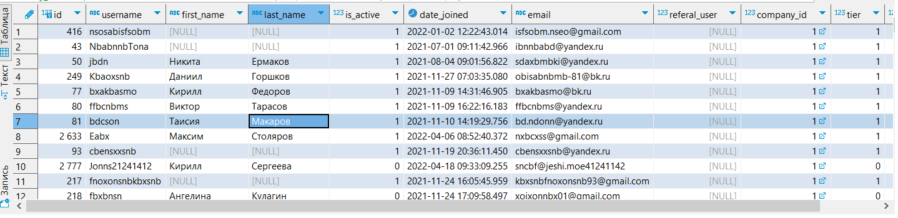  

Также возьму активность пользователей по дням - если пользователь в какой-то день делал выгрузку запроса, проверку задания или начинал тест, то будет показана дата дня и id пользователя. Для этого через union буду извлекать id пользователя и дату действия. Т.к. union убирает дубли, каждая пара id и даты будет уникальна. При этом делаю join каждой таблицы с my_users, чтобы взять только интересующих меня пользователей
```
days_users_activity as (
	select user_id, date(created_at) as activ_date
	from coderun c
	join my_users u
	on u.id = c.user_id
	union
	select user_id, date(created_at) as activ_date
	from codesubmit c2 
	join my_users u
	on u.id = c2.user_id
	union
	select user_id, date(created_at) as activ_date
	from teststart t
	join my_users u
	on u.id = t.user_id
)
```
Результат запроса:  
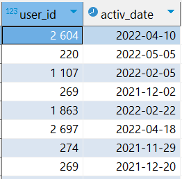 

И найду вообще всю активность пользователей с временем активности. Алгоритм похож на предыдущий, только теперь использую union all и оставляю формат даты-времени.
```
all_users_activity as (
	select user_id, created_at as activ_date
	from coderun c 
	join my_users mu on
	c.user_id = mu.id
	union all
	select user_id, created_at as activ_date
	from codesubmit c2
	join my_users mu on
	c2.user_id = mu.id
	union all
	select user_id, created_at as activ_date
	from teststart t
	join my_users mu on
	t.user_id = mu.id
)
``` 
Результат:  
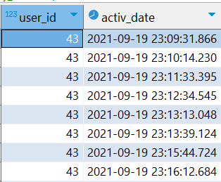 

# Блок Преподавателя

### Активность пользователей по дням недели:
Для начала я хочу получить просто дату, день недели, количество действий, которое выполнялось в конкретный день, и количество пользователей, которые что-то делали на платформе в этот день. При этом я не хочу потерять те дни, в которых активности и пользователей вообще не было - иначе это повлияет на средние значения.
Поэтому я генерирую интервал дней, чтобы затем присоединить его join-ом и не потерять дни без активности.
Использую функцию generate_series, беря интервал от самой первой до самой последней активности вообще, и из полученного интервала с помощью функции date извлекаю дату.
``` sql
gen_days as (
	select date(generate_series(
	(select min(activ_date) from days_users_activity), 
	(select max(activ_date) from days_users_activity),
	'1 day'::interval)) as day_date
)
```
Этот запрос я буду использовать и в дальнейшем.  
Далее могу получить активность каждого дня. Для этого right join-ом присоединяю к таблице all_users_activity сгенерированный интервал. Группирую по дате и дню недели, и извлекаю дату, день недели, количество действий пользователей с помощью агрегатной функции count и кол-во самих пользователей, использую внутри count distinct, чтобы убрать повторы.
``` sql
dayweek_activ as (
	select gd.day_date as date, 
	to_char(date(gd.day_date), 'Day') as day_week, 
	count(user_id) as action_cnt, -- это количество действий пользователей
	count(distinct user_id) as users_cnt -- это количество самих пользователей
	from all_users_activity ua
	right join gen_days gd
	on date(activ_date) = gd.day_date
	group by date, day_week
	order by date
)
```
Результат запроса:  
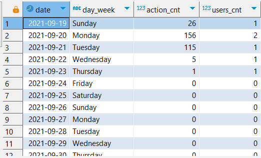  

Теперь можно посчитать общее количество действий через sum, а также усреднить полученные значения путем группировки по дням недели и узнать среднее количество активности функцией avg. Также возьму медиану кол-ва действий, так как она менее чувствительна к выбросам и её тоже полезно смотреть.
``` sql
avg_dayweek_activ as (
	select day_week, sum(action_cnt) as action_cnt, 
	round(avg(action_cnt), 2) as avg_actions, 
	round(avg(users_cnt), 2) as avg_users,
	percentile_disc(0.5) within group (order by action_cnt) as median_actions
	from dayweek_activ
	group by day_week
	order by avg_actions desc
)
```
Результат:  
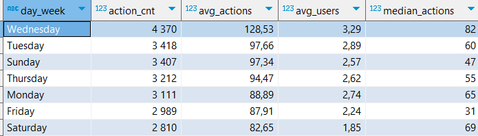  

#### Выводы:
Наибольшая активность наблюдается в среду, а самые неактивные дни в пятницу и субботу. При этом, хоть средняя активность в пятницу выше, чем в субботу, её медиана у пятницы рекордно низкая. Скорее всего было много дней, где в этот была около нулевая активность, при этом также были дни, где в пятницу активность была высока, иначе и средняя была бы низкой.
Общие выводы, что к концу недели и началу выходных большинство людей уходит отдыхать и не столь активно занимается на платформе. В воскресень, вторник и среду наибольшая активность, поэтому в эти дни у преподавателя скорее всего будет наибольшая нагрузка.

### Активность пользователей по часам дня
Как и для прошлого запроса, сгенерирую интервал дат по часам от самой первой до самой последней активности, чтобы не потерять часы без активности. Обрезаю формат даты-времени до часа с помощью функции date_trunc
``` sql
gen_hours as (
	select date_trunc('hour', generate_series(
	(select min(activ_date) from all_users_activity),
	(select max(activ_date) from all_users_activity),
	'1 hour'::interval)) as hour
)
```
После этого получу активность каждого часа в каждом дне. Действия почти аналогичны предыдущему пункту про дни недели
``` sql
hour_activ as (
	select date(g.hour) as date, 
	extract(hour from g.hour) as hour,
	count(user_id) as actions_cnt, 
	count(distinct user_id) as users_cnt
	from all_users_activity aua
	right join gen_hours g
	on date(g.hour) = date(aua.activ_date) 
	and extract (hour from activ_date) = extract(hour from g.hour)
	group by date, g.hour
	order by date, g.hour
)
```
Результат запроса:  
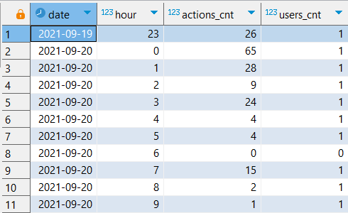

Далее группирую по часам, считаю сумму и средне действий и среднее пользователей. Медиана здесь не показательна, т.к. слишком много нулей.
``` sql
avg_hour_activ as (
	select hour, sum(actions_cnt) as actions_cnt, sum(users_cnt) as users_cnt,
	round(avg(actions_cnt), 2) as avg_actions,
	round(avg(users_cnt),2) as avg_users
	from hour_activ
	group by hour
	order by avg_actions desc
)
```
Результат запроса:  
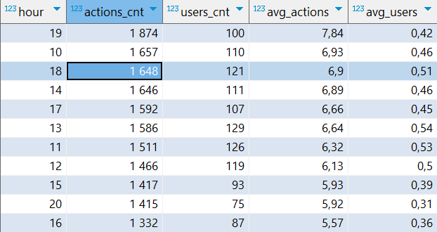

#### Выводы  
Самые активные периоды - 10.00-15.00 и 17.00-20.00. С большим отрывом лидирует время с 19.00 до 20.00. Самые неактивные часы, как и ожидалось, ночные - с 22.00 до 6.00. С этой информацией преподавателю будет легче планировать свою нагрузку.  

### Средняя длительность сессии
Сессией буду считать цепочку действий пользователя на платформе, между которыми проходит не более 60 минут. Если прошло больше - будем считать это новой сессией. Длину сессии буду считать в минутах. Пользоваться буду созданнной ранее таблицей all_users_activity. 
Для начала с помощью оконной функции lead найду время следующей активности пользователя и разницу между текущей и следующей активностью с помощью extract(epoch). Введу "флаг" new_session, равный 0 если разница между активностью меньше 60 и 1 в ином случае. 
``` sql
activity_timediff as (
	select *,
	lead(activ_date) over w as next_activ,
	extract(epoch from lead(activ_date) over w - activ_date)/60 as diff,
	case
		when extract(epoch from lead(activ_date) over w - activ_date)/60 <60 then 0
		else 1
	end as new_session
	from all_users_activity
	window w as (partition by user_id order by activ_date)
)
```

Далее сделаю "маркеры" сессий, просуммировав флаги функцией sum(), используя её как оконную. Окно беру с начала до текущей строки. Это даст номер для каждой сессии пользователя. При этом, чтобы не портить разницу между активностью внутри сессии, обнуляю "переходную" активность - там, где разница между парой больше 60 минут, т.е. начинается новая сессия.  
``` sql
session_markers AS (
    SELECT *,
    SUM(new_session) OVER (PARTITION BY user_id 
    ORDER BY activ_date ROWS BETWEEN UNBOUNDED PRECEDING AND CURRENT ROW) AS session_id,
    case 
		when diff>60 then 0
		else diff
	end as new_diff
    FROM activity_timediff
)
```
Результат запроса:  
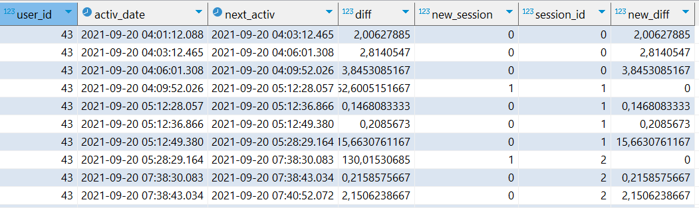  

После считаю длительность каждой сессии, суммируя все разницы между активностями внутри одной сессии через sum, группируя по user_id и session_id.
``` sql
session_duration as (
	select user_id, session_id, sum(new_diff) as duration
	from session_markers
	group by user_id, session_id
	order by user_id, session_id
)
```  
Теперь можно получить среднюю длительность сессии в общем через avg. Также можно взять медиану через percentile_disc.
``` sql
avg_session_duration as (
	select round(avg(duration)) as avg_minute,
	round(percentile_disc(0.5) within group (order by duration)) as median_minute
	from session_duration
)
```  
Результат запроса:  
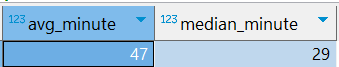  

А теперь посчитаем количество сессий и их среднюю длительность для каждого пользователя с помощью группировки. Для удобства возьмем из предыдущей CTE среднюю длительность с помощью подзапроса.  
``` sql
user_session_info as (
	select user_id, 
	count(session_id) as session_cnt,
	round(avg(duration)) as avg_minute,
	(select avg_minute from avg_session_duration) as avg_session_dur
	from session_duration
	group by user_id
)
```  
Результат запроса:  
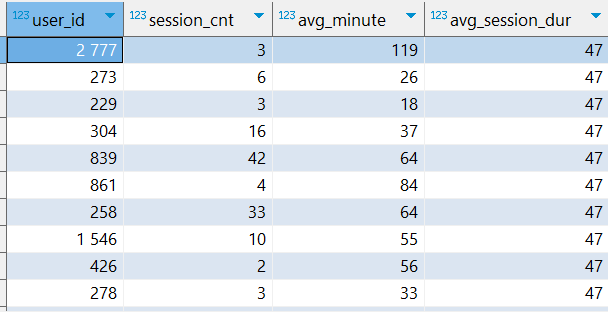  

Помимо этого, можно посмотреть распределение длительностей сессий по перцентилям с шагом 0.1. Для этого использую generate_series(0.1, 1, 0.1), названный как perc, и команду percentile_cont.
``` sql
duration_percentile as (
	select perc, percentile_cont(perc) within group (order by avg_minute) as duration 
	from user_session_info, pg_catalog.generate_series(0.1, 1, 0.1) perc
	group by perc
)
```  
Результат запроса:  
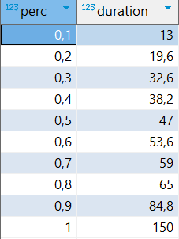  

#### Итоги
Теперь преподаватель может видеть заинтересованность каждого пользователя, смотря на его среднюю длительность сессии или на каждую сессию в отдельности. Также он может посмотреть, в какой "когорте" находится пользователь по длительности. Если с низкой длительносью - возможно у пользователя возникают какие-то трудности с использованием платформы или с самими заданиями и преподаватель может помочь это исправить.  

### Самые популярные задачи  
Популярность буду оценивать по двум критериям - количество пользователей, которые пытались решить эту задачу (таблица codesubmit) и сколько раз вообще пользователь взаимодействовал с задачей (запуск кода и проверка решения, таблицы coderun и codesubmit).
Для первого критерия объединю таблицы codesubmit и my_users обычным join-ом, таблицу problem right join-ом, чтобы не потерять те задачи, которые вообще не решали, и таблицы languagetoproblem и language. Извлеку из полученной таблицы problem_id, complexity (сложность), название задания, язык програмирования для задачи, количество пользователей, которые пытались решить эту задачу, процент верных попыток, который буду искать через case и ранг задачи по кол-ву пользователей. Отсортирую по количеству пользователей.
``` sql
problems_info as (
	select p.id as problem_id, 
	complexity, 
	p.name, 
	lg.name as lang,
	count(distinct user_id) as users_cnt,
	round(count(case when is_false = 0 then 1 end)*100.0/count(*),2) as perc_right,
	rank() over (order by count(distinct user_id) desc) as rank_in_users
	from codesubmit c 
	join my_users mu
	on c.user_id = mu.id
	right join problem p 
	on p.id = c.problem_id
	join languagetoproblem l  
	on l.pr_id = p.id
	join language lg
	on lg.id = l.lang_id
	where is_visible is true  -- чтобы пользователи видели эти задачи
	group by p.id, complexity, p.name, lg.name
	order by users_cnt desc
)
``` 
Результат запроса:  
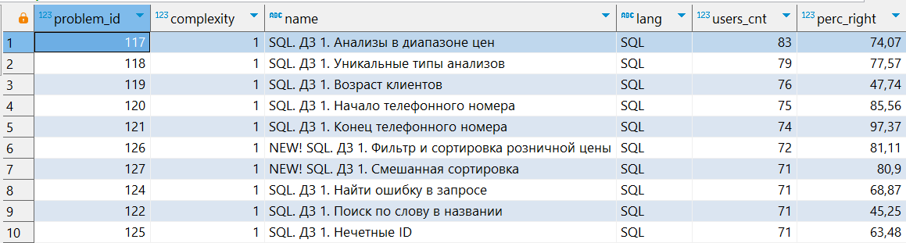  

Второй критерий - количество взаимодействий пользователя с задачей. Этот показатель тоже покажет, какие задачи популярные - может быть их не выставляли на проверку, т.к. не получалось, но при этом много работали с ней, потому что она интересная и т.д.
В запросе для начала объединяю таблицы codesubmit и coderun через union all, записываю это в CTE problem_starts.  
Далее к этой таблице присоединяю right join-ом problem, а затем languagetoproblem и language. Извлекаю problem_id, сложность, название задачи, язык программирования, кол-во "активаций" задачи и ранг по активациям. Ранг получаю для того, чтобы потом объединить starts_count и problems_info и сравнить полученные результаты - задачи с наибольшим кол-вом пользователей также и самые "трогаемые", или нет.
``` sql
problem_starts as (
	select problem_id 
	from coderun cr
	join my_users mu
	on mu.id = cr.user_id
	union all
	select problem_id
	from codesubmit cs
	join my_users mu
	on mu.id = cs.user_id
)
starts_count as (
	select problem_id, 
	complexity, 
	p.name, 
	lg.name,
	count(problem_id) as starts_cnt,
	rank() over (order by count(problem_id) desc) as starts_rank
	from problem_starts ps
	right join problem p
	on p.id = ps.problem_id
	join languagetoproblem l  
	on l.pr_id = p.id
	join language lg
	on lg.id = l.lang_id
	group by problem_id, complexity, p.name, lg.name
)
```  
Результат запроса:  
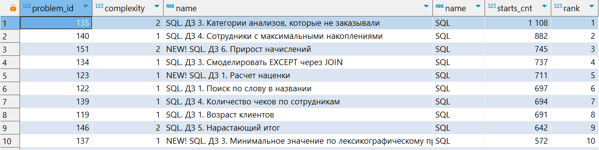   

### Топ 20 популярных задач
Теперь можно объединить эти запросы и поискать самые популярные задачи по этим критериям. Я считаю, что кол-во пользователей, которые пытались решить задачу, важнее, поэтому сортирую по ней. Но с помощью второго критерия можно более правильно отранжировать задачи, например, если по кол-ву пользователей задачи мало отличаются, но у второй значительно больше активаций, то поставим её выше.
``` sql
problems_rank as (
	select sc.problem_id, 
	sc.name,
	sc.complexity,
	sc.lang, 
	rank_in_users, starts_rank
	from starts_count  sc
	join problems_info p
	on sc.problem_id = p.problem_id
	order by rank_in_users, starts_rank
	limit 20
)
```  
Результат запроса:  
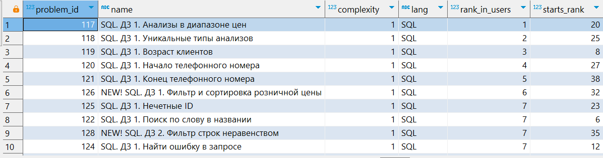  

Дополнительно можно фильтровать по сложности, языку или домашнему/не домашнему.  

#### Выводы
Cамые популярные задачи - по SQL первой сложности, в основном это дз. Если убрать дз - то ранг по пользователям сильно падает, и в таком случае самые популярные - тестовое задание в альфа-банк с SQL и некоторые задачи на python. Если смотреть в разрезе языка, то python менее популярен, самые популярные у него это также дз.  

### Процент успешных попыток по задаче
Процент успешных попыток по задаче по всем решениям я уже получал в CTE problems_info.  
  

### Сколько у студента ушло попыток на решение задачи
Т.е. какая по очередности попытка была первой правильной.  
Для начала я объединю таблицу codesubmit с my_users. Возьму id пользователя, задачи, параметр is_false и через оконную функцию номер строки, сортируя по дате (т.е. по очередности).
``` sql
rank_codesubmit as (
	select user_id, 
	problem_id, 
	is_false,
	row_number() over (partition by user_id, problem_id order by created_at) as row_num
	from codesubmit c 
	join my_users mu
	on c.user_id = mu.id
	order by user_id, created_at 
)
```  
Далее из полученной таблицы возьму только те строки, где is_false = 0 (т.е успешные попытки), сгруппирую по id пользователя и задачи и возьму минимальный номер строки, тем самым получив номер первой успешной попытки.
``` sql
min_user_attempts as (
	select user_id, problem_id,
	min(row_num) as right_attempt
	from rank_codesubmit
	where is_false = 0
	group by user_id, problem_id
)
```  
Результат запроса:  
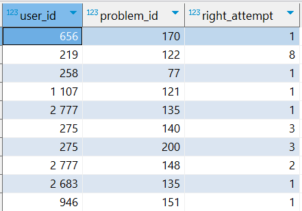   
#### Итог
Преподаватель сможет посмотреть, насколько легко или тяжело у студента получилась та или иная задача.

### К каким задачам приступал студент и какие он решил  
Объединим таблицу codesubmit и my_users. Сгруппирую по user_id, username, problem_id. Извеку id пользователя, его ник, id проблемы, и булево значение done, равное True, если задача хоть один раз была решена правильно.
``` sql
user_problems as (
	select user_id, username, problem_id,
	case when min(is_false) = 0 then true else false end as done
	from codesubmit c 
	join my_users mu
	on c.user_id = mu.id
	group by user_id, username, problem_id
	order by user_id, problem_id
)
```  
Результат запроса:  
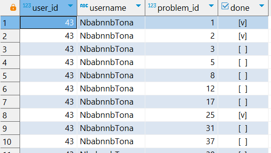  

Дополнительно к этому запросу можно посчитать сколько всего задач он пытался решить и сколько в итоге решил.
Для этого использую функцию count как оконную, считая кол-во задач, кол-во решенных задач через case и нахожу процент от общего числа.
``` sql
user_problems_info as (
	select *,
	count(problem_id) over w as cnt_problems,
	count(case when done is true then 1 end) over w as cnt_right,
	round(count(case when done is true then 1 end) over w *100.0/count(problem_id) over w) as "right (%)"
	from user_problems
	window w as (partition by user_id)
),
```
Результат запроса:  
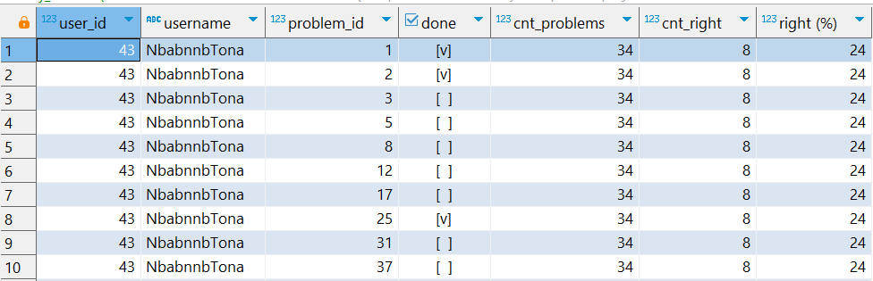  

#### Итог  
Теперь преподаватель сможет оценить успехи каждого студента в разрезе каждой задачи и в общем.  

### Процент успешных попыток пользователя по задаче и в общем  
Для нахождения процента успешных попыток для каждой задачи опять присоединяю к codesubmit таблицу my_users. Группирую по id пользователя и проблемы, извлекаю user_id, problem_id, кол-во верных попыток, кол-во всех попыток и отношение первого ко второму в процентах. Это позволит посмотреть, как хорошо пользователь решает задачи.
``` sql
user_attempts_to_problem as (
	select user_id, problem_id,
	count(case when is_false = 0 then 1 end) as right_attempt_cnt,
	count(*) as attempt_cnt,
	round(count(case when is_false = 0 then 1 end)*100.0/count(*), 2) as "right (%)"
	from codesubmit c
	join my_users mu
	on c.user_id = mu.id
	group by user_id, problem_id
)
```  
Результат запроса:  
  

Теперь можно усреднить эти значения, сгруппировав по пользователю
``` sql
user_avg_right_attempt as (
	select user_id, 
	round(avg("right (%)"), 2) as "right (%)"
	from user_attempts_to_problem
	group by user_id
)
```
Результат запроса:  
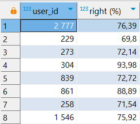  

#### Итог
Теперь преподаватель может на успешность пользователя, и помогать, если видно, что возникают трудности. Например, топ 5 студентов с самым низким процентом успеха это 43, 1178, 589, 1217, 2643.

### На каких задачах возникают трудности
Посмотрим, на какие задачи уходит больше всего попыток и у каких задач низкий уровень правильных ответов  
Для изучения среднего кол-ва попыток для решения задачи обращусь к ранее созданной таблице min_user_attempts, сгруппирую по задаче и получу среднее через avg, округляя до целого.
``` sql
avg_attempts_for_problem as (
	select problem_id, round(avg(right_attempt), 2) as avg_attempt
	from min_user_attempts
	group by problem_id
)
```   
Результат запроса:  
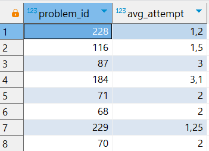  

Далее к этой таблице можно присоединить problems_info:  
``` sql
problems_attempts_info as (
	select atp.*, pi.perc_right,
	pi.users_cnt, pi.name, 
	pi.complexity, pi.lang
	from avg_attempts_for_problem atp
	JOIN problems_info pi
	ON pi.problem_id = atp.problem_id
)
```  
Убирая те задачи, на которых было меньше 3-х человек (чтобы иметь хоть какую-то статистику) и сортируя по кол-ву попыток для решения, получим:
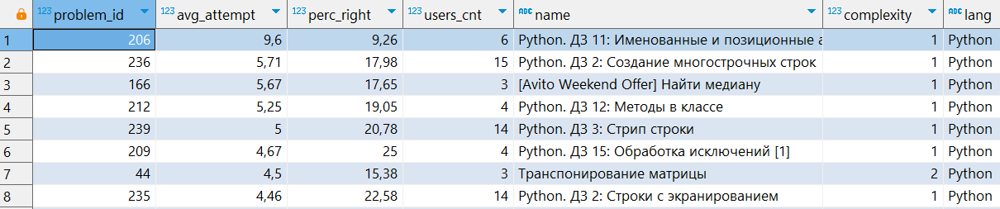  
Сортируя по проценту правильных решений:
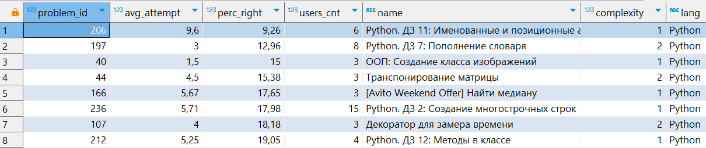  
#### Вывод
Топ 8 задач в каждой сортировке занимают задачи на python. Возможно, методистам стоит изменить блок объяснения питона, а преподавателю быть готовым к большей работе с учениками по этому блоку.  

### Какое количество пользователей решает задачи разной сложности и разных языков
Для среза по сложности использую таблицы codesubmit, my_users и problem. Группирую по сложности и извлекаю сложность, процент успешных попыток через count(case...), кол-во всех попыток, кол-во решаемых задач этой сложности, и кол-во уникальных пользователей, которые решали задачи этой сложности  
``` sql
perc_right_with_compl as (
	select complexity, 
	round(count(case when is_false = 0 then 1 end)*100.0/count(*), 2) as perc_right,
	count(*) as submit_cnt,
	count(case when is_false = 0 then 1 end) as right_submit_cnt,
	count(distinct problem_id) as problem_cnt,
	count(distinct mu.id) as user_cnt
	from codesubmit c
	join my_users mu
	on c.user_id = mu.id
	join problem p
	on p.id = c.problem_id
	group by complexity
)
```  
Результат запроса:  
  

Для среза по языкам алгоритм похожий, но дополнительно я присоединяю таблицы languagetoproblem и language. Группирую по языку и извлекаю ЯП вместо сложности.
``` sql
perc_right_with_lang as (
	select l.name, round(count(case when is_false = 0 then 1 end)*100.0/count(*), 2) as perc_right,
	count(*) as submit_cnt,
	count(case when is_false = 0 then 1 end) as right_submit_cnt,
	count(distinct problem_id) as problem_cnt,
	count(distinct mu.id) as user_cnt
	from codesubmit c
	join my_users mu
	on c.user_id = mu.id
	join problem p
	on p.id = c.problem_id
	join languagetoproblem lp
	on lp.pr_id = p.id
	join language l
	on l.id = lp.lang_id
	group by l.name
)
```  
Результат запроса:  
  

#### Вывод
Задачи 1 и 2 сложности решают почти одинаково кол-во людей, при этом задачи 3 сложности значительно менее популярны, до них дошло всего 15 студентов. При этом процент верных решений по сложности не сильно отличается и находится примерно на уровне 50% процентов.
На срезе по языку можно увидеть, что задачи на SQL значительно более популярны - их решает более чем в два раза больше студентов. При этом задаче по SQL в среднем легче (или более понятны )- процент успешных решений больше на 12 в сравнении с показателями питона. 

### Сколько раз приступали к каждому тесту
Использую таблицы teststart и my_users. Группирую по test_id, извлекаю id теста и кол-во раз, когда его начинали. Сортирую по убыванию кол-ва, дабы посмотреть на самые популярные тесты.
``` sql
teststart_count as (
	select test_id, t.name, count(*) as start_cnt
	from teststart ts
	join my_users mu
	on mu.id = ts.user_id
	join test t
	on t.id = ts.test_id
	group by test_id, t.name
	order by start_cnt desc
)
```  
Результат запроса:  
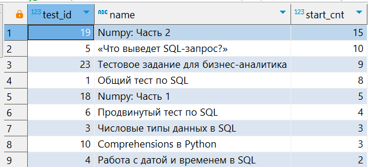  

#### Итог
Тесты 19, 5, 23, 1 и 18 - самые популярные. С большим отрывом лидирует тест 19 по Numpy часть 2, после него 2 теста по sql и тестовое на бизнес аналитика. 

### Сколько раз отдельный студент начинал тест
К таблице teststart присоединяю my_users через right_join, чтобы не потерять тех, кто вообще не приступал к тестам. Группирую по mu.id, считаю кол-во уникальных тестов, которые решал пользователь. Сортирую по убыванию test_cnt, чтобы видеть тех, кто хоть что-то решал.
``` sql
users_test as (
	select mu.id as user_id, count(distinct test_id) as test_cnt
	from teststart ts
	right join my_users mu
	on ts.user_id = mu.id
	group by mu.id
	order by test_cnt desc
)
```  
Результат запроса:  
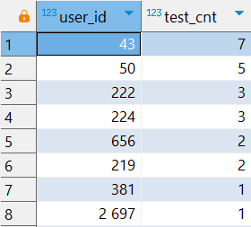  

#### Вывод
По результатам запроса видно, что всего лишь 14 пользователей решали хоть один тест. Пользователь 43 - самый активный.   
После таких скудных результов мне стало интересно, а какой процент пользователей от общего кол-ва вообще приступали к тестам, и сколько тогда приходится тестов на человека.
Для этого из users_test кол-во тестирующихся юзеров, полученное с помощью count(case...), делю на общее кол-во пользователей, так я получаю процент тех, кто решал тесты, и также через avg(test_cnt) получаю среднее кол-во тестов на человека.
``` sql
testing_users as (
	select round(count(case when test_cnt > 0 then 1 end)*100.0/count(*), 2) as perc_testing_users,
	round(avg(test_cnt), 2) as avg_test_cnt
	from users_test
),
```  
Эту таблицу можно присоединить к предыдущей, чтобы было более наглядно  
```
users_test_info as (
	select * 
	from users_test ut
	cross join testing_users teu
)
```  
Результат запроса (грустные, если смотреть на процент тестируемых :( ):  
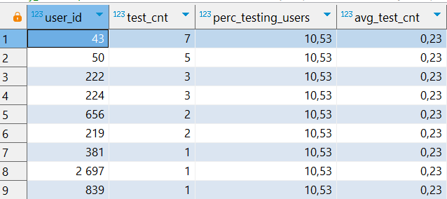  

#### Вывод
Если компания хочет, чтобы её студенты проходили тесты, то ей определенно нужно поработать либо с привлечением студентов на тесты, либо, возможно, с качеством самих тестов.  

### Какие ответы давал пользователь в тесте 
Здесь будет большой запрос.  
Беру таблицу testanswer, join-ом присоединяю к ней testquestion, right join-ом testresult, чтобы не потерять "пустые" ответы, к этому присоединяю my_users и test. Добавляю условие, что ответ пользователя должен совпадать с одним из возможнных ответов в вопросе, или же быть null-ом. Группирую по user_id, question_id, вопросу, test_id, answer_id, датой создания и именем теста. Делаю это, чтобы убрать множественный повторяющийся null. Извлекаю отсюда user_id, question_id, сам вопрос, id ответа, корректен ли он (делаю это через агрегатную функцию bool_and (т.к. использую группировку) и case), дату создания, ранг через оконную функцию, чтобы можно было отличить разные прохождения теста, id и имя теста. Полученную махину сортирую.
``` sql
users_answers as (
	select user_id, 
	t.question_id, 
	t2.value, answer_id, 
	bool_and(case when answer_id is not null then is_correct else false end) as is_correct, 
	t3.created_at, 
	/* ранг для того, чтобы разгранить разные прохождения тестов друг от друга */
	rank() over (partition by user_id, t2.test_id, t.question_id order by created_at) as rank_order, 
	t2.test_id,
	te.name
	from testanswer t
	join testquestion t2 
	on t.question_id = t2.id
	right join testresult t3 
	on t3.test_id = t2.test_id and t3.question_id = t.question_id
	join my_users mu
	on mu.id = t3.user_id
	join test te
	on te.id = t3.test_id
	where coalesce(answer_id, t.id) = t.id -- оставляет ответы, которые совпадают с одним из вариантов ответа, и null-ы
	group by user_id, t.question_id, t2.value, t2.test_id, answer_id, t3.created_at, te.name -- сделано для того, чтобы убрать множественный null
	order by user_id, test_id, rank_order, question_id
)
```  
Результат запроса:  
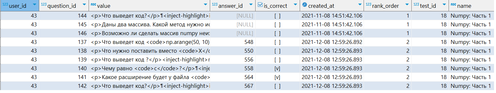  
#### Итог
С этой таблицей можно просмотреть ответы каждого отдельного пользователя. Посмотреть его прогресс, если он решал тест снова.

### Какие тесты решал каждый пользователь, сколько у него было правильных ответов
Буду использовать полученную прошлым запросом таблицу users_answers.  Сгруппирую по user_id, test_id, rank_order и date(created_at). Извлеку эти же параметры, дополнив также кол-вом вопросов в тесте, кол-вом правильных ответом и процентом правильных ответов.
``` sql
users_tests_info as (
	select user_id, test_id, date(created_at) as created_at, rank_order, count(*) as all_quest, 
	count(case when is_correct is true then 1 end) as right_answer,
	round(count(case when is_correct is true then 1 end)*100.0/count(*), 2) as  "right (%)"
	from users_answers
	group by user_id, test_id, rank_order, date(created_at)
)
```  
Результат запроса:  
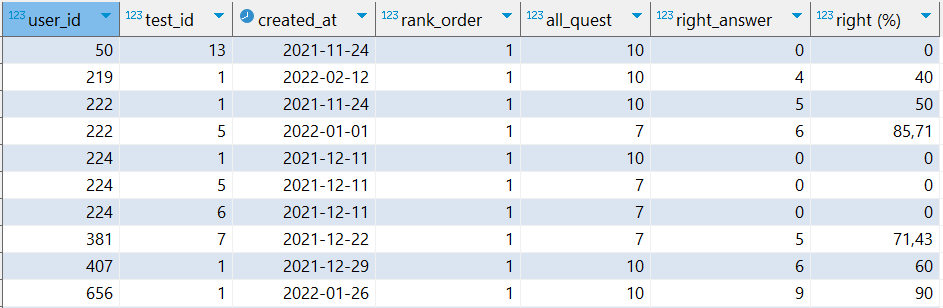  
#### Итог
Это более приятная глазу таблица, чем предыщущая. Она может помочь преподавателю увидеть успехи студентов по курсам, и помочь им, если в этом возникнет необходимость. Интересным фактом является, что пользователь с id 43 15 раз решал 18 тест. Возможно, его что-то в нем заинтересовало.  

### Статистика прохождений тестов
В дополнение к предыдущей таблице посмотреть на общую статистику прохождения каждого теста  
Для этого делаю join таблицы test, группирую по id и названию теста и извлекаю id, название, кол-во запусков, кол-во вопросов через max(), среднее кол-во и средний процент правильных ответов
``` sql
testresult_research as (
	select test_id, t.name, count(*) as running_cnt,
	max(all_quest) as all_quest,
	round(avg(right_answer), 2) as avg_right_answer,
	round(avg("right (%)"), 2) as "avg_right (%)"
	from users_tests_info uti
	join test t
	on t.id = uti.test_id
	group by test_id, t.name
)
```  
Результат запроса:  
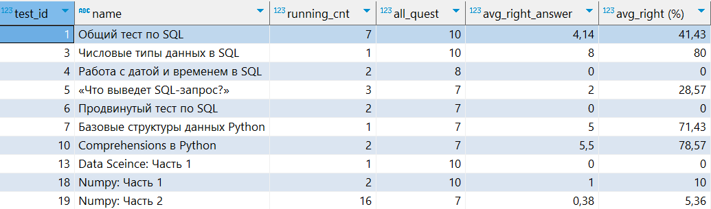  
#### Вывод
Всего лишь 10 из 24 тестов хотя бы раз запускали. При этом запусков все равно небольшое кол-во, за исключением 19 теста, но большинство из них выполнил пользователь с id 43. Стоит заметить, что полученные данные расходятся с таблицей teststart_count, т.е. почему-то информация о начале теста есть, а информации о завершении - нет. Возможно, произошел какой-то сбой на сервере. Но, хоть здесь и мало информации, даже по ней преподаватель может оценить сложность теста.  


 # Блок Финансового директора

### Сколько всего проверок решений и сколько на пользователя 
Для начала через union all таблиц codesbmit и testresult получу id пользователей, работы которых нужно проверить (задача или тест)  
``` sql
all_checks as (
	select user_id
	from codesubmit c
	join my_users mu
	on mu.id = c.user_id
	union all
	select user_id
	from testresult t
	join my_users mu
	on mu.id = t.user_id
)
```  
Далее сгруппирую по id и получу кол-во проверок по пользователю  
``` sql
all_user_checks as( 
	select user_id, count(user_id) as cnt_check
	from all_checks
	group by user_id
)
```  
Результат запроса:  
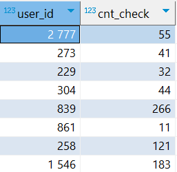  

И затем просуммирую всё количество проверок, получив общее кол-во, получу среднее кол-во проверок на пользователя и медиана проверок.
``` sql
checks_info as (
	select sum(cnt_check) as cnt_check,
	round(avg(cnt_check)) as avg_check_for_user,
	percentile_disc(0.5) within group (order by cnt_check) as median_check
	from all_user_checks
)
```  
Результат запроса:  
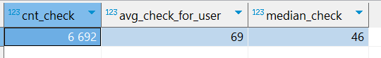  
#### Вывод
С этой информацией финансовый директор может просчитать, насколько выгодно сотрудничество с IT Resume. Например, если для проверок нужен бы был специально нанятый для этого человек, которому платили бы за каждрую проверку, можно было бы посчитать выгоду от автоматизации проверки.  

### Количество задач и тестов
``` sql
problems_and_tests_cnt as (
	select 'problems' as type, count(id) as cnt
	from problem
	union 
	select 'tests', count(id)
	from test
)
```  
Результат запроса:  
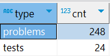   

### Количество пришедших пользователей по месяцам
Возьму таблицу my_users, извлеку с помощью to_char месяц регистрации, сгруппирую по нему и посчитаю кол-во пришедших уникальных пользователей.  
``` sql
users_joined_on_month as (
	select to_char(date_joined, 'YYYY-MM') as month, count(distinct id) as cnt_joined
	from my_users
	group by month
)
```  
Результат запроса:  
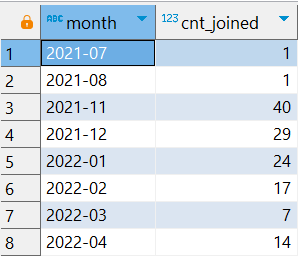   
#### Вывод
Самые большие приросты были в период осени-зимы 2021 года. В следующие несколько месяцев новых пользователей было не столь много

### MAU и WAU
Для начала найду кол-во активных пользователей (т.е. тех, кто делал хоть что-то кроме захода) по месяцам.
``` sql
activ_users_on_month as (
	select to_char(activ_date, 'YYYY-MM') as month, count(distinct user_id) as users_cnt
	from days_users_activity ua
	group by month
	order by month
)
```  
Результат запроса:  
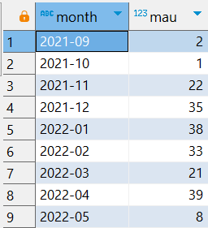   

Далее объединяю две последние полученные таблицы через full join по совпадению месяцев, убираю те, где месячная активность пользователей была меньше 4. Извлекаю месяц, месячную активность, количество пришедших в этом месяце, суммарное кол-во пришедших пользователей за этот и прошлые месяца, отношение кол-ва активных в этом месяце пользователей к общему числу пришедних, и среднее кол-во активности за все месяцы. 
``` sql
mau_research as (
	select m.month as month, users_cnt, coalesce (cnt_joined, 0) as cnt_joined, 
	sum(cnt_joined) over (order by coalesce(m.month, u.month)) as all_users,
	coalesce(round(users_cnt*100.0/sum(cnt_joined) over (order by coalesce(m.month, u.month)), 2),0) as "activ_users (%)",
	round(avg(users_cnt)  over ()) as MAU
	from activ_users_on_month m
	full join users_joined_on_month u
	on m.month = u.month
	where users_cnt > 3 -- убрали месяца со слишком малыми значениями
	order by month
)
```  
Результат запроса:  
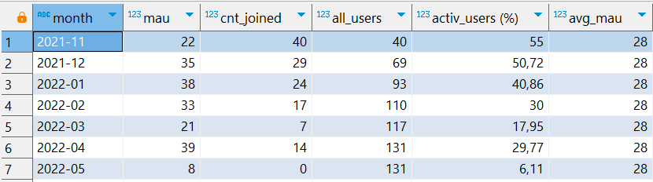   
#### Вывод
Наибольшая активность была 2022-01 и в 2022-04. При этом во втором случае больше половины было "старых" пользователей - тех, кто пришел до этого. Можно увидеть, что далеко не все пришедшие пользователи остаются на платформе на длительный срок. Возможно они получают то, за чем пришли, и уходят довольными, либо же наоборот, их что-то не устраивает на платформе, поэтому они перестают заходить.  

Проделаю то же самое и для недель:
``` sql
users_joined_on_week as (
	select to_char(date_joined, 'YYYY-WW') as week, count(distinct id) as cnt_joined
	from my_users
	group by week
)
```  
Дополнительно генерирую интервал недель, чтобы использовать join-ом и не потерять недели без активности
``` sql
gen_weeks as (
	select to_char(generate_series(
	(select min(activ_date) from days_users_activity), 
	(select max(activ_date) from days_users_activity),
	'1 day'::interval), 'YYYY-WW') as week
	group by week
)
```
Результат запроса:  
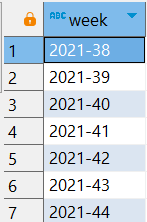   
Можно видеть, что первая активная неделя была 2021-38.

Найду кол-во активных пользователей по неделям   
``` sql
activ_users_on_week as (
	select week, count(distinct user_id) as users_cnt
	from days_users_activity ua
	full join gen_weeks g
	on to_char(activ_date, 'YYYY-WW') = g.week 
	group by  week
	order by week
)
```
Ищу процент активных пользователей, метрику WAU
``` sql
wau_research as (
	select coalesce(w.week, uw.week) as week, coalesce (users_cnt, 0) as users_cnt,
	coalesce (cnt_joined, 0) as cnt_joined,
	sum(cnt_joined) over (order by coalesce(w.week, uw.week)) as all_users,
	coalesce(round(users_cnt*100.0/sum(cnt_joined) over (order by coalesce(w.week, uw.week)), 2),0) as "activ_users (%)",
	round(avg(users_cnt)  over ()) as WAU
	from activ_users_on_week w
	full join users_joined_on_week uw
	on w.week = uw.week
)
```
Результат запроса:  
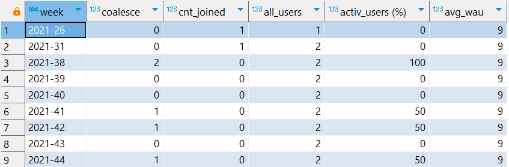  
#### Вывод
Усредненный wau составляет 9 человек. Это примерно 1/3 от mau - не самый хороший показатель, но не совсем ужасный. Без прихода новых пользователей недельная активность довольно быстро падает, это определенно плохой показатель - вряд ли пользователь получает необходимые ему знания всего за неделю. Стоит разобраться, почему пользователи уходят.
Возможно необходимо провести качественнное исследование, опросив студентов, почему они ушли или что их не устраивает  

### Удержание (retention) и отток (churn rate)
Буду считать не просто retention,а rolling retention, и обратный для него churn rate. Выбор использовать именно rolling retention обусловлен тем, что платформа IT Resume - образовательная, и для неё не сильно важно, чтобы пользователи заходили каждый день. Человек может отдыхать в выходные и заниматься обучением в будние дни, или наоборот, или как угодно иначе. Поэтому важно оценить не конкретные дни, а промежутки, например, какой процент людей заходил хотя бы раз после 6 дня захода на платформу.  
Считать буду по когортам - в какой месяц пользователь зарегистрировался, к такой когорте он и принадлежит.  
Для начала получу таблицу заходов пользователей. Для этого объединю таблицы userentry и my_users. Извлеку id пользователя, дату регистрации, дату захода, разницу между ними и когорту пользователя с помощью to_char.
``` sql
entry_info as (
	select u.user_id, date(date_joined) as joined, date(entry_at) as entry,  
	extract(days from entry_at - date_joined) as diff,
	to_char(date_joined, 'YYYY-MM') as cohort
	from userentry u
	join my_users m
	on u.user_id = m.id
	order by user_id, diff
)
```  
Результат запроса:  
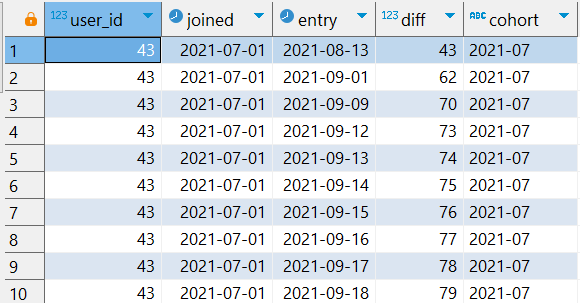  

Далее через длинный запрос, в котором я считаю отношение кол-ва зашедших хотя бы раз в определенный день и все после него к кол-ву зашедших в 0-вой день (т.е. в день регистрации). Считаю это через distinct case user_id, у которых разница (diff) больше или равен указанному значению. Для отслеживания выберу 0, 1, 3, 7, 14, 21, 30, 45, 60, 90 и 120 дни - их достаточно, чтобы оценить заходы пользователь. Группирую по когортам, и дополнительно задаю условие, чтобы в когорте было больше 3 человек (иначе статистика будет совсем нерепрезентативна) 
``` sql
rolling_retention as (
	select cohort, count(distinct user_id) as cohort_size,
	round(count(distinct case when diff >= 0 then user_id end)*100.0/
		count(distinct case when diff >= 0 then user_id end), 2) as "0 (%)",
	round(count(distinct case when diff >= 1 then user_id end)*100.0/
		count(distinct case when diff >= 0 then user_id end), 2) as "1 (%)",
	round(count(distinct case when diff >= 3 then user_id end)*100.0/
		count(distinct case when diff >= 0 then user_id end), 2) as "3 (%)",
	round(count(distinct case when diff >= 7 then user_id end)*100.0/
		count(distinct case when diff >= 0 then user_id end), 2) as "7 (%)",
	round(count(distinct case when diff >= 14 then user_id end)*100.0/
		count(distinct case when diff >= 0 then user_id end), 2) as "14 (%)",
	round(count(distinct case when diff >= 21 then user_id end)*100.0/
		count(distinct case when diff >= 0 then user_id end), 2) as "21 (%)",
	round(count(distinct case when diff >= 30 then user_id end)*100.0/
		count(distinct case when diff >= 0 then user_id end), 2) as "30 (%)",
	round(count(distinct case when diff >= 45 then user_id end)*100.0/
		count(distinct case when diff >= 0 then user_id end), 2) as "45 (%)",
	round(count(distinct case when diff >= 60 then user_id end)*100.0/
		count(distinct case when diff >= 0 then user_id end), 2) as "60 (%)",
	round(count(distinct case when diff >= 90 then user_id end)*100.0/
		count(distinct case when diff >= 0 then user_id end), 2) as "90 (%)",
	round(count(distinct case when diff >= 120 then user_id end)*100.0/
		count(distinct case when diff >= 0 then user_id end), 2) as "120 (%)" --интересно посмотреть за активными группами 2021-11 и 2021-12 месяцев
	from entry_info
	group by cohort
	having count(distinct user_id)>3 -- уберем слишком малые когорты
)
```  
Результат запроса:  
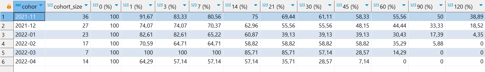  

#### Вывод
Первая когорта (2021-11) - самая большая и самая устойчивая. Следующие идут по убыванию. Да, есть когорта за 2022-03, но она слишком маленькая. На таблице видно, что пользователи достаточно плавно утекают, и это продолжается до 2 месяца, затем идёт более резкий спад.

Посчитаю rolling churn rate, вычитая rolling retention из 100:
``` sql
Rolling_churn_rate as (
	select cohort, 100 - "1 (%)" as "1 (%)",
	100 - "3 (%)" as "3 (%)",
	100 - "7 (%)" as "7 (%)",
	100 - "14 (%)" as "14 (%)",
	100 - "30 (%)" as "30 (%)",
	100 - "60 (%)" as "60 (%)"
	from rolling_retention
)
```
Результат запроса:  
  
#### Итог
Можно более наглядно увидеть, как уходили пользователи с платформы.

### Общее распределение codecoins по списаниям и пополнениям
Для начала дам необходимую информацию: у транзакций есть типы, тип «списание» имеют записи с id: 1, 23-28, тип «начисление» имеют записи с id: 2-22, 29. Транзакции большие 500 не учитываются, т.к. это начисления бета-тестерам.  

Для начала посчитаю, какое значение codecoins в сумме на каждый тип.
Для этого объединяю таблицы transaction, transactiontype и my_users. Группирую по type_id и description, извлекаю эти два параметра,сумму значений типа и кол-во таких транзаций.
``` sql
transaction_type_sum as (
	select type_id, description,
	sum(t.value) as summ,
	count(t.value) as cnt_actions
	from transaction t
	join transactiontype ty 
	on ty.type = t.type_id
	join my_users mu
	on mu.id = t.user_id
	where t.value <= 500
	group by type_id, description
	order by type_id
)
```  
Результат запроса:  
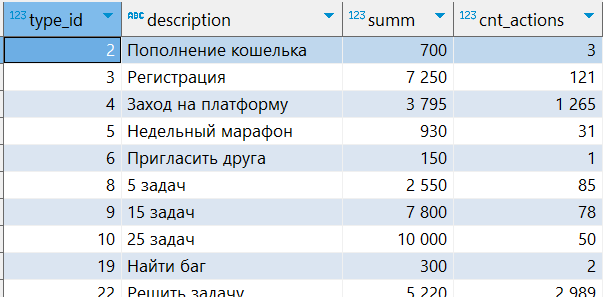  

Теперь можно просуммировать значения транзакций-списаний и транзакций-начислений:
``` sql
all_transactions_info as (
	select sum(summ) as all_transactions_value,
	sum(case when type_id in (1, 23, 24, 25, 26, 27, 28) then cnt_actions end) as write_off_cnt,
	sum(case when type_id in (1, 23, 24, 25, 26, 27, 28) then summ end) as write_off_value,
	sum(case when type_id not in (1, 23, 24, 25, 26, 27, 28) then cnt_actions end) as accurals_cnt,
	sum(case when type_id not in (1, 23, 24, 25, 26, 27, 28) then summ end) as accurals_value
	from transaction_type_sum
)
```  
Результат запроса:  
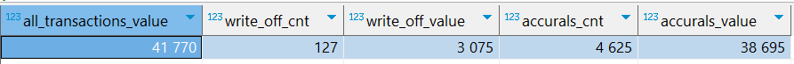  
#### Вывод
Можно увидеть, что корпоративные студенты практически не списывают свои коины. А также, если посмотреть на начисления типа "пополнение кошелька", то таких операций было всего 3. Это означает, что напрямую компания не начисляет codecoins. Но возможно, что для студентов компании коины начисляются каким-то другим образом.
Поэтому можно сделать вывод, что если сотрудничество компании с IT Resume подразумевает также оплату codecoins для студентов, то компании следует пересмотреть объемы покупки внутренней валюты. 


### Среднее значение списаний и начислений на пользователя
Сначало найду списания и начисления коинов по каждому пользователю  
Для этого объединяю таблицы transaction и my_users, группирую по user_id, извлекаю user_id, и через case суммирую сначала транзакции с типом списаний, затем с типом начислений, а затем разница между этими показателями, тоже через case. Т.к. у некоторых пользователей может не быть списаний или начислений, использую coalesce, чтобы заменить null-ы на 0.
``` sql
users_transactions as (
	select user_id,
	coalesce(sum(case when type_id in (1, 23, 24, 25, 26, 27, 28) then -value end), 0) as write_off,
	coalesce(sum(case when type_id not in (1, 23, 24, 25, 26, 27, 28) then value end),0) as accruals,
	sum(case when type_id in (1, 23, 24, 25, 26, 27, 28) then -value else value end) as balance
	from transaction t
	join my_users mu
	on t.user_id = mu.id
	where value<=500
	group by user_id
)
```
Результат запроса:  
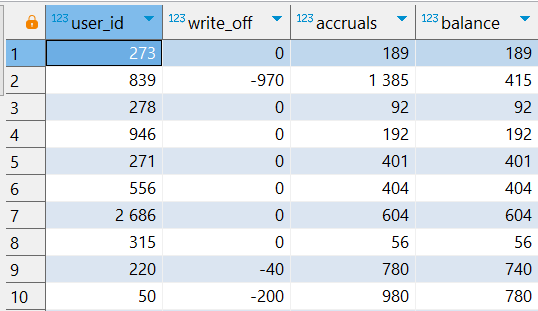  
Можно увидеть, что даже на первых 10 строках данных много нулей на списаниях. Т.к. я не знаю о том, что доступно для корпоративных студентов, могу предположить, что для них доступно большая часть задач и им не нужно тратить codecoin-ы для открытия новых задач или получения подсказок, т.к. у них и так, в большинстве случаев, их достаточно для комфортного изучения материала.  

Теперь усредню эти показатели с помощью avg:  
``` sql
avg_balance as (
	select round(avg(write_off), 2) as write_off, round(avg(accruals), 2) as accruals, 
	round(avg(balance), 2) as balance
	from users_transactions
) 
``` 
Результат запроса:  
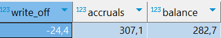  
#### Вывод
Значения списаний дейсвительно очень маленькие, в основном пользователи только копят коины и, соответственно, имеют высокий баланс.  

Видя такие показатели, мне стало интересно, а за что пользовотели получили больше всего коинов и куда их тратят. Поэтому, используя созданную ранее таблицу transaction_type_sum, я отобрал сначала только начисления, а потом - только списания, и отсортировал по размерам сумм.
``` sql
select * 
from transaction_type_sum 
where type_id not in (1, 23, 24, 25, 26, 27, 28)
order by summ desc
```  
Результат запроса:  
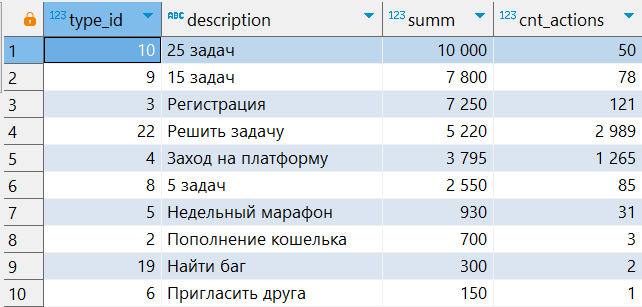  
Если убрать в условии "not", то будут транзакции списания:  
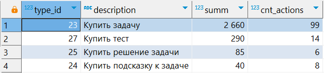  
#### Вывод
Видно, что пользователи получают коины в основном за решения задач, регистрацию и заходы на платформу. А тратят в большинстве случаев (хоть они и редки) на покупки задач (видимо кому-то хочется порешать побольше).    

### Распределение баланса пользователей
Последним интересным показателем для фин. директора я посчитал разбивку баланса пользователей по перцентилям от 0.1 до 1. Т.е если пользователь в 0.1 перцентиле, значит его баланс ниже 90% всех показателей балансов.  
Для нахождения распределения я буду использовать созданную ранее таблицу users_transactions и созданый с помощью generate_series список от 0.1 до  - это будут перцентили perc. Группирую по перцентилю perc, извлекаю перцентиль и с помощью команды percentile_cont(perc) получаю значение баланса, соответсвующего опредленному значению.
``` sql
percentile_balance as (
	select perc, percentile_disc(perc) within group (order by balance) as balance
	from users_transactions, generate_series(0.1, 1, 0.1) as perc
	group by perc
)
```  
Результат запроса:  
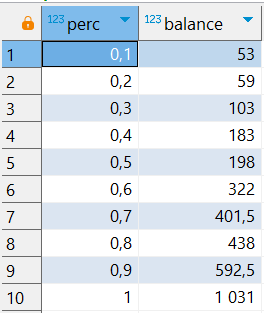  
#### Вывод
Можно увидеть, что медиана баланса довольно сильно отличается от среднего - более чем 80 коинов. Это говорит о наличии выбросов со значениями в большую сторону. Опять же, если в стоимость сотрудничества платформы и компании входят и codecoins для студентов, то для компании было бы лучшим вариантом, чтобы средние значения были ближе к 0 - т.е. чтобы пользователи сразу тратили коины на что-то интересное.  


# Блок Генерального директора
Т.к. много показателей я уже считал до этого, я буду просто оставлять ссылку на фрагмент в тексте.  

### Количество пользователей, пришедших в разные месяца
[Эти значения](#количество-пришедших-пользователей-по-месяцам) как раз есть в блоке про финансового директора  
<br> 

### Количество активных пользователей (по месяцам, MAU, WAU, DAU)
[Исследование MAU и WAU](#mau-и-wau) я также проводил в блоке для финансового директора.  
Для генерального директора проведу также исследование DAU.
Для начала я сгенерирую интервал дат, от самой первой до самой последней зафиксированной активности. Делается это, чтобы потом объединить эту таблицу с активностью пользователей и не потерять дни без активности.  
``` sql
gen_days as (
	select date(generate_series(
	(select min(activ_date) from days_users_activity), 
	(select max(activ_date) from days_users_activity),
	'1 day'::interval)) as day_date
)
```  
Далее делаю full join сгенерированного интервала к таблице days_users_activity.
``` sql
activ_users_on_day as (
	select day_date, count(distinct user_id) as users_cnt
	from days_users_activity ua
	full join gen_days g
	on date(activ_date) = g.day_date
	group by day_date
	order by day_date
)
```
Результат запроса:  
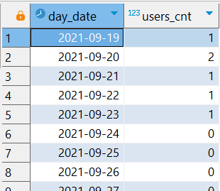  

А дальше через оконную функцию дополнительно выведу среднее значение, т.е. наше DAU:
``` sql
DAU as (
	select *, round(avg(users_cnt) over ()) as dau
	from activ_users_on_day
)
```  
Результат запроса:  
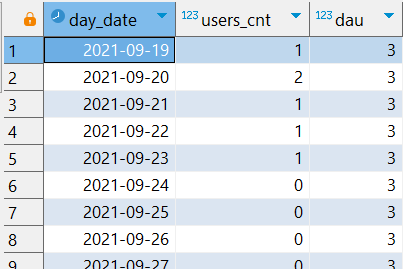  

#### Вывод
DAU равен 3, хоть показатель и маленький, но он равен 1/3 от WAU(9) и почти 1/9 от MAU (28). Далеко не самый плохое отношение. Это показывает, что пользователи остаются на платформе и заходят помимо первого "касания" продукта.   
<br> 

### Общее количество входов на платформу
Найду кол-во заходов в месяц (считаю с повторами, т.е. если пользователь заходил несколько раз, то тоже считается).  
Для этого объединяю таблицы userentry и my_users. Извлекаю из entry_at год-месяц с помощью to_char, группирую по месяцам, считаю кол-во строк (т.е. кол-во входов), кол-во уникальных пользователей и ранг по месяцу. Это использую дальше, чтобы взять среднее трех последних месяцев.  
``` sql
months_userentry as (
	select  to_char(entry_at, 'YYYY-MM') as month, count(*) as entry_cnt,
	count(distinct user_id) as user_cnt,
	rank() over (order by to_char(entry_at, 'YYYY-MM') desc) -- ранг использую в дальнейшем
	from userentry u 
	join my_users mu
	on mu.id = u.user_id
	group by month
	order by month
)
```  
Результат запроса:  
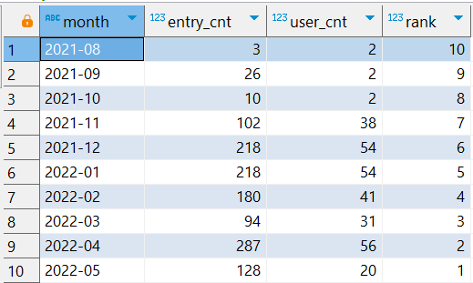  
#### Вывод
Данные схожи с таблицей [mau_research](#mau-и-wau). Пик заходов осень-зима 21-22 года. 2021-09 2 пользователя заходили 26 раз - скорее всего какой-то один пользователь заходил очень часто.  

Посчитаю среднее число заходов в месяц. Также найду медиану для более точных данных. Использую функции avg и percentile_disc
``` sql
avg_months_userentry as (
	select round(avg(entry_cnt)) as month_avg_entries,
	percentile_disc(0.5) within group (order by entry_cnt) as month_median_entries,
	round(avg(user_cnt)) as month_avg_users,
	percentile_disc(0.5) within group (order by user_cnt) as month_median_users
	from months_userentry
	where entry_cnt > 5 -- уберем месяца со слишком малым числом входов
)
```  
Результат запроса:  
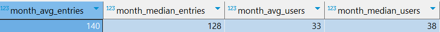  
Видно, что усредненные заходы не сильно отличаются от медианы заходов. Также и с кол-вом пользователей. Данные распределены достаточно равномерно.

Также можно посчитать среднее для последних трех месяцев. Считать медиану не буду, т.к. всего лишь из трех значений она мало что будет значить.
Для этого как раз использую ранг месяца, который получил в таблице months_userentry.
``` sql
last_3_month_entries as (
	select round(avg(entry_cnt)) as avg_last_3_month_entries,
	round(avg(user_cnt)) as avg_last_3_month_users
	from months_userentry
	where rank in (1, 2, 3)
)
```
Результат запроса:  
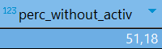  
#### Итог
Теперь можно смотреть на актуальную статистику последних трех месяцев.  
<br> 

### Средняя длительность сессии
[Длительность сессии](#средняя-длительность-сессии) есть в блоке финансового директора  
<br> 

### Процент заходов без активности
Посчитаю тех, кто заходил на платформу, но больше за этот заход ничего не делал.
Для этого объединю userentry, my_users и days_users_activity с помощью left join, чтобы не потерять те сессии, в которых активности как раз и не будет (дата активности activ_date будет null). Останется посчитать кол-во тех сессий, в которых activ_date равен null и делать это на кол-во всех сессий, что и будет процент без активности 
``` sql
entries_without_activ as (
	select round(count(case when activ_date is null then 1 end)*100.0/count(*),2) as perc_without_activ
	from userentry u
	join my_users mu
	on u.user_id = mu.id
	left join days_users_activity ua
	on u.user_id = ua.user_id and date(u.entry_at) = ua.activ_date
)
```  
Результат запроса:  

#### Вывод
Видно, что более 50% заходов проходит без активности. Это очень большой показатель, и курсу/платформе стоит поработать с этим показателем. Как вариант, после захода можно предлагать пользователю сразу перейти на ту задачу, которую он решал последней. Или давать студенту статистику, сколько ему еще осталось задач в том блоке, который он решал.  
<br> 

### Удержание и отток 
Я уже считал [эти метрики](#удержание-retention-и-отток-churn-rate) для финансового директора  
<br> 

### Lifetime пользователя
Lifetime буду считать по заходам пользователя. Если пользователь заходит в течении 30 дней от прошлого своего захода, то его "жизнь" продолжается. Если же он заходит позже 30 дней, то он будет считаться как бы новым пользователем. Так я отмерю длительность "жизни" каждого пользователя, а потом усредню.  
Действовать я буду примерно также, как считал длительность сессии пользователя.  
Для начала найду разницу между заходами через оконную функцию lead. Использую объединение таблиц userentry и my_users. Также не буду брать июль и август 2021 года, потому что там слишком мало пользователей, которые, к тому же, возможно, являются тестировщиками.
``` sql
users_entries_different as (
	select user_id, 
	lag(entry_at) over w as prev_entry,
	entry_at as entry, 
	coalesce(extract(days from entry_at - lag(entry_at) over w), 0) as diff
	from userentry u
	join my_users m
	on u.user_id = m.id
	where to_char(date_joined, 'YYYY-MM') not in ('2021-07', '2021-08') 
	window w as (partition by user_id order by entry_at)
)
```  
Уберу строки с последними заходами (где next_entry равен null). Проверю, новая ли это "жизнь" у пользователя через case, поставив маркер 1, если новая. 
``` sql
lifes_markers as (
	select *, case 
		when diff < 30 then 0
		else 1
	end as new_user_life
	from users_entries_different
)
```  
Результат запроса:  
  

Далее, суммируя маркеры, получу id "жизни" пользователя.  
``` sql
lifes_id as (
	select *, sum(new_user_life) over (partition by user_id 
	rows between unbounded preceding and current row) as user_life_id
	from lifes_markers
)
```

А после, группируя по пользователю и id сессии, просуммирую все разницы между заходами, получив тем самым длительность "жизни". Дополнительно обнуляю разницу в заходах между разными "жизнями".
``` sql
users_life_duration as (
	select user_id, user_life_id,
	extract(days from max(entry)-min(entry)) as duration
	from lifes_id
	group by user_id, user_life_id
)
```  
Результат запроса:  
    

И теперь получу среднее через avg. Это и будет lifetime.
``` sql
LT as (
	select round(avg(duration)) as duration
	from users_life_duration
)
```  
Результат запроса:  
  

#### Вывод
Средняя длительность сессии пользователя достаточно хорошая. За 20 дней действительно можно успеть получить новые практические навыки.   
<br> 

### Сколько всего задач и тестов
``` sql
problems_and_tests_cnt as (
	select 'problems' as type, count(id) as cnt
	from problem
	union 
	select 'tests', count(id)
	from test
)
```  
Результат запроса:  
  

Также можно посмотреть на кол-во задач по языку:
``` sql
language_problems_count as (	
	select  l.name, count(*) as problem_cnt,
	sum(count(*)) over () as all_problems
	from languagetoproblem lp
	join language l
	on l.id = lp.lang_id
	group by l.name
)
```  
Результат запроса:  
  
И по сложности:
``` sql
complexity_problems_count as (
	select complexity, count(*)
	from problem
	group by complexity
)
```  
  
<br> 

### Топ 20 популярных задач
[Топ задач](#топ-20-популярных-задач) я получал в блоке для преподавателя.  
<br> 

### Сколько было решено студентами задач всего или с разбивкой по сложности/языкам
Буду считать кол-во всех задач, которые решили студенты. Если несколько студентов решили одну и ту же задачу, то каждое решение будет учитываться. При этом не буду считать повторные решения студента, даже есть он решил одну и ту же задачу 10 раз, считать буду только один.  
В блоке для преподавателя я изучал, [какие задачи решил каждый пользователь](#к-каким-задачам-приступал-студент-и-какие-он-решил). Буду использовать таблицу user_problems, полученную в том блоке:  
  
Чтобы получить, сколько всего было решено задач, посчитаю кол-во тех задач, которые студент смог решить. 
Отберу только те задачи, которые были решены, и посчитаю их кол-во.   
``` sql
solved_problems_cnt as (
	select count(*) as cnt
	from user_problems
	where done is true
)
```  
Результат запроса:  
  
Чтобы посмотреть в разрезе сложности, можно к user_problems присоединить таблицу problem и сгруппировать по сложности.  
``` sql
solved_problems_by_complexity_cnt as (
	select complexity, count(*) as cnt
	from user_problems up
	join problem p
	on p.id = up.problem_id
	where done is true
	group by complexity
)
```  
Результат запроса:  
  
Для разбивки по языкам нужно присоединять таблицы languagetoproblem и language и группировать по языку.  
``` sql
solved_problems_cnt_by_lang as (
	select l.name, count(*) as cnt
	from user_problems up
	join languagetoproblem lp
	on up.problem_id = lp.pr_id
	join language l
	on l.id = lp.lang_id
	where done is true
	group by l.name
)
```  
Результат запроса:  
  

Если же генеральному директору понадобится более подробная информация, то её можно посмотреть [тут](#какое-количество-пользователей-решает-задачи-разной-сложности-и-разных-языков)  
<br> 


# Блок Маркетолога

### Сколько всего задач и тестов с разбивкой по языкам и сложности
Эту информацию я извлекал в блоке для генерального директора [тут](#сколько-всего-задач-и-тестов)  
<br> 

### Сколько задач решили студенты
Этот же вопрос был в блоке генерального директора [тут](#сколько-было-решено-студентами-задач-всего-или-с-разбивкой-по-сложностиязыкам)  
<br> 

### Топ 20 популярных задач
Это, опять таки, уже было в блоке преподавателя [здесь](#топ-20-популярных-задач)  
<br> 

### Количество корпоративных пользователей на платформе 
Эту информацию можно посмотреть в CTE [таблице mau_research](#mau-и-wau), которую я создавал в блоке для финансового директора.  
   
<br> 


# Блок Методиста

### Какие задачи самые популярные   
Ответ на данный вопрос я находил в блоке преподавателя [здесь](#самые-популярные-задачи)  
<br>

### Какой процент правильных решений по каждой задаче
Процент успешных попыток по задаче по всем решениям я уже получал в CTE problems_info.  
   
<br> 

### Среднее процента решенных студентом задач относительно всех пробуемых им задач
Для получения ответа буду использовать таблицу user_problems_info, полученную в блоке преподавателя [здесь](#к-каким-задачам-приступал-студент-и-какие-он-решил). В этой таблице есть кол-во задач, к которым студент приступал, и кол-во тех, которые решил. Эти значения получены через оконную функцию, поэтому повторяются много раз.  
Для начала я посчитаю процент решенных задач по каждому студенту. Для этого сгруппирую по пользователю, и извлеку отношения кол-ва решенных задач ко всем пробуемых. Т.к. эти значения у каждого студента одинаковы (т.к. я использовал оконную функцию по окну студента), то для избегания ошибок я буду получать максимальное число с помощью max.
``` sql
avg_solved_problems_per_user as (
	select user_id, max(cnt_right)*100.0/max(cnt_problems) as perc_right
	from user_problems_info 
	group by user_id
)
```  
Далее я посчитаю среднее и медиану:
``` sql
avg_solved_problems as (
	select round(avg(perc_right), 2) as avg_solved, 
	percentile_cont(0.5) within group (order by perc_right) as median_solved
	from avg_solved_problems_per_user
)
```  
Результат запроса:  
  
#### Вывод
И среднее, и медиана очень высоки - как минимум половина пользователей решает все задачи из тех, которые хоть раз отправляет на проверку. 
Но можно попробовать посмотреть на процент решения тех, которые пользователь только начинал делать (запускал тест своего кода, но не отправлял его на проверку). Скорее всего в данном случае результаты будут хуже.  
Для этого буду использовать коррелированный подзапрос: буду брать user_id, problem_id из таблицы problem_starts (получал её в блоке преподавателя) и результат коррелированного подзапроса из таблицы user_problems, который выдает, решил ли пользователь задачу или нет.
``` sql
users_coderun_problems as (
	select distinct ps.user_id, ps.problem_id,
	coalesce((
		select bool_or(done) from user_problems up 
		where ps.user_id =up.user_id and up.problem_id = ps.problem_id
	), false) as done
	from problem_starts ps
)
```  
Результат запроса:  
  

Далее группирую полученные значения по user_id, считаю процент решенных задач.   
``` sql
users_perc_right_per_coderun_problems as (
	select user_id, count(case when done is true then 1 end)*100.0/count(*) as perc_solved
	from users_coderun_problems
	group by user_id
)
```  
А затем считаю среднее полученных значений и медиану.  
``` sql
avg_solved_coderun_problems as (
	select round(avg(perc_solved), 2) as avg_solved,
	percentile_cont(0.5) within group (order by perc_solved)  as median_solved
	from users_perc_right_per_coderun_problems
)
```  
Результат запроса:  
  
#### Вывод
Медиана значений не изменилась, все ещё 100%, а среднее несколько упало - с 96.83 до 93.86. Это не критичная разница, большинство задач, к которым пользователь приступает, он также решает, и это определенно хороший показатель.  
<br> 

### У каких задач низкий процент решений  
Этот вопрос я также изучал в блоке преподавателя, смотреть [тут](#на-каких-задачах-возникают-трудности) 
<br> 

### Сколько в среднем попыток на задачу определенной сложности или ЯП, если задача была выполнена  
В блоке преподавателя в блоке [изучения трудних задач](#на-каких-задачах-возникают-трудности) я получил таблицу problems_attempts_info, в которой по каждой задачи идет среднее число попыток для её решения.  
Используя эту таблицу и группируя по сложности, можно получить среднее число попыток на задачу определенной сложности  
``` sql
attempts_at_complexity as (
	select complexity, round(avg(avg_attempt), 2) as avg_attempt
	from problems_attempts_info
	group by complexity
)
```
Результат запроса:  
  

Можно увидеть, что самые сложные задачи со сложностью 3 уходит меньше попыток, чем на задачи сложности 2. Это можно объяснить, что, во-первых, самые сложные задачи решает меньше людей, во-вторых, пользователь действительно обучается новым навыкам, и поэтому после легких и средних задач он спокойно может решать и сложные.  
Группируя по ЯП, получим:  
``` sql
attempts_at_language as (
	select lang, round(avg(avg_attempt), 2) as avg_attempt
	from problems_attempts_info
	group by lang
)
```  
Результат запроса:  

#### Вывод
Можно увидеть, что более тяжко у пользователей идут задачи по python. Это может быть связано как с просто более сложными задачами, так и, возможно, с разным преподавателями. И на sql преподаватель может объяснять материал более понятно.  
<br> 

### Сколько в среднем попыток уходит на конкретную задачу, выделить с самым большим количеством  
Опять же, было в блоке преподавателя [про сложные задачи](#на-каких-задачах-возникают-трудности)
<br> 

### Есть ли задачи, которые вообще не трогали  
Ранее я создавал таблицу problem_starts, в которой есть все старты задач (то есть запуск кода в coderun и проба решения в codesubmit). Извлеку из таблицы problem все задачи, которых нет в problem_starts. Сделаю условие, чтобы они были видны (is_visible=True). 
``` sql
not_trying_problems as (
	select *  
	from problem
	where id not in (select problem_id from problem_starts) and is_visible is True
)
```  
Результат запроса:  
  
Видно, что 38 задач ни разу не пробовалось корпоративными пользователями. Возможно, их просто нет в корпоративном курсе. Или никто ими не заинтересовался.
<br> 

### Сколько задач в среднем решает пользователь  
В блоке преподавателя, отвечая на вопрос про [задачи студента](#к-каким-задачам-приступал-студент-и-какие-он-решил), я получил таблицу user_problems_info. Извлекая уникальные строки user_id, cnt_right cnt_problems и right (%) через distinct, получу таблицу users_info
``` sql
users_info as (
	select distinct user_id, cnt_right, cnt_problems, "right (%)"
	 from user_problems_info
)
```  
И затем получу среднее число задач и средний процент решенных задач:
``` sql
avg_cnt_solved_problems as (
	select round(avg(cnt_right)) as cnt_right, 
	round(avg(cnt_problems)) as cnt_problems,
	round(avg("right (%)"),2) as avg_right
	from users_info
)
```
Результат запроса:  
    
#### Итог
Если смотреть на процент решенных задач, то он отличный - больше 95 процентов. Но вот если обратить внимание на кол-во решенных и начатых задач, то уже не так все радужно. В доступе пользователей 248 задач, а в среднем решают только 31, приступая к 32, что маловато. Конечно нужно учитывать и объем курса клиентов - если он небольшой, то 31 задача это хорошо. Но вот если идёт полный доступ к задачам IT Resume, то пользователи используют далеко не все доступное, и с этим нужно что-то сделать.
<br> 

### Какое количество пользователей решает задачи разной сложности, процент от общего кол-ва  
На этот вопрос я отвечал в блоке преподавателя [тут](#какое-количество-пользователей-решает-задачи-разной-сложности-и-разных-языков). Если нужно посмотреть на процент от всех пользователей, можно дописать подзапрос:
```
select *, 
round(user_cnt*100.0/(select count(*) from my_users)) as perc_users 
from perc_right_with_compl
```  
Результат запроса:  
   
#### Итог
Видно, что идёт резкий упадок на задачах 3-ей сложности. А до задач 2-ой сложности доходит только 50% пользователей. Думаю, что этот показатель стоит увеличивать. Возможно стоит либо изменить задачи, показав примеры задач из реального бизнеса, либо стоит больше углубляться в объяснения методов решений задач.
<br> 

### Какие тесты, сколько и насколько успешно решали  
Исследование по этому вопросу я делал в блоке преподавателя по [статистике тестов](#статистика-прохождений-тестов)
<br> 

### К каким тестам не приступали
В данном запросе буду использовать таблицы test, teststart и my_users. Извлеку все тесты из test, к которые не приступали корпоративные пользователи my_users. Сделаю это с помощью подзапроса и where in.
``` sql
not_starting_test as (
	select * from test
	where id not in (
		select distinct test_id 
		from teststart t
		join my_users mu
		on mu.id = t.user_id
	)
)
```  
Результат запроса:  
   
#### Вывод
Половину тестов даже не начинали. Опять же, либо это связано с малым размером курса, либо же пользователей не заинтересовали:  
* а) сами тесты и их структура  
* б) темы тестов  
Можно узнать это, спросив самих пользователей (устров, например, опрос).  
Либо пользователи почему-то вообще не видели этих тестов. Тогда нужно дать пользователям возможность их увидеть через специальную напоминалку или предложения или более удобный интерфейс.  
